# SERS-AI 임상 데이터 표준화 보고서

**프로젝트:** SERS 기반 소변 스크리닝 다중 암 탐지 파이프라인
**작성일:** 2026-03-18
**데이터 출처:** 삼성서울병원 국가바이오빅데이터 (SMCXD01/03/05/06, SMCMD06)
**표준화 스크립트:** `standardize_clinical.py`, `link_sers_clinical.py`

---

## 1. 개요 (Overview)

본 보고서는 SERS-AI 프로젝트에 사용되는 임상 데이터의 표준화 결과를 요약한다. 총 16개의 원본 엑셀 파일로부터 11개 질환군의 임상정보를 68개 표준 컬럼으로 통합하였으며, SERS 스펙트럼 데이터와의 연결(linkage) 및 상관관계 분석을 수행하였다.

| 항목 | 값 |
|---|---|
| 전체 환자 수 | **1,570명** |
| 질환군 수 | **11개** (비암 4 + 암 7) |
| 표준 컬럼 수 | **68개** |
| SERS-임상 매칭 환자 수 | **1,170명** (SERS 1,344명 중 87%) |
| 시료 채취 시점 분류 | **1,400명** (89.2%) — pre-op / peri-op / post-op / control |
| 출력 파일 | `all_clinical_standardized.csv` + 질환별 11개 CSV + SERS 연결 3개 CSV |

---

## 2. 연구 대상 (Study Population)

### 2.1 질환군 구성

| 분류 | 질환군 | 약칭 | 환자 수 | 원본 파일 |
|---|---|---|---:|---|
| **비암 대조군** | 정상 | NOR | 100 | SMCXD03_정상인 1, 2 |
| | 당뇨 | DIA | 100 | SMCXD03_당뇨 1, 2 |
| | 고혈압 | HBP | 100 | SMCXD03_고혈압 |
| | 당뇨+고혈압 | H.D. | 100 | SMCXD05_당뇨+고혈압 |
| **비암 소계** | | | **400** | |
| **암 환자** | 전립선암 | PRO | 100 | SMCXD01_전립선암 |
| | 유방암 | BRE | 30 | SMCXD01_유방암 |
| | 난소암 | OVA | 70 | SMCXD01_난소암 1, 2 |
| | 폐암 | LUN | 300 | SMCXD01_폐암 1, SMCXD06_폐암 2, 3 |
| | 대장암 | CRC | 300 | SMCXD06_대장암 |
| | 췌장암 | PAN | 70 | SMCMD06_췌장암 |
| | 방광암 | BLA | 300 | SMCXD06_방광암 |
| **암 소계** | | | **1,170** | |
| **전체** | | | **1,570** | |

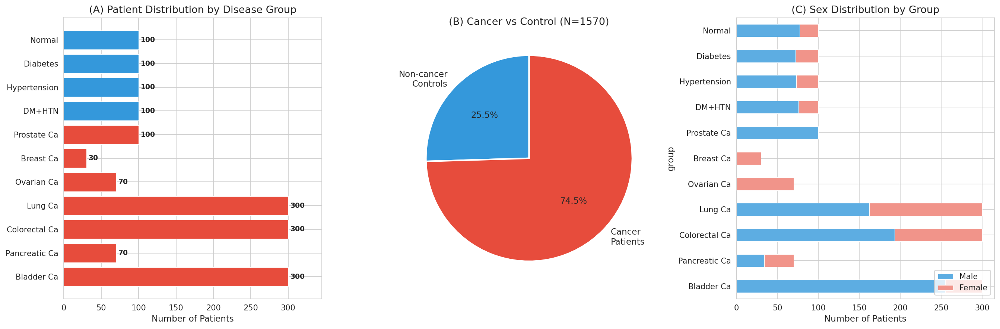
*Figure 1. 질환군별 환자 수 분포(A), 암/비암 비율(B), 성별 분포(C). 비암 대조군 400명(25.5%), 암 환자 1,170명(74.5%).*

### 2.2 원본 데이터 스키마 유형

| 유형 | 컬럼 수 | 해당 파일 | 특징 |
|---|---:|---|---|
| SMCXD03/05 | ~546 | 정상, 당뇨, 고혈압, 당뇨+고혈압 | 건강검진 포맷, 종합 검사결과 포함 |
| SMCXD01 | 14–23 | 전립선암, 유방암, 난소암, 폐암1 | 간이 포맷, 진단 중심 |
| SMCXD06 | 23–62 | 폐암2/3, 대장암, 췌장암, 방광암 | 중간 포맷, 검사결과 포함 |

---

## 3. 인구통계학적 특성 (Demographics)

### 3.1 연령

| 질환군 | N | 평균 ± SD |
|---|---:|---|
| NOR | 100 | 45.3 ± 11.5 |
| DIA | 100 | 60.2 ± 9.5 |
| HBP | 100 | 60.0 ± 9.0 |
| H.D. | 100 | 62.4 ± 10.6 |
| PRO | 100 | 73.4 ± 9.1 |
| BRE | 30 | 60.5 ± 12.5 |
| OVA | 70 | 54.5 ± 12.3 |
| LUN | 300 | 65.4 ± 9.3 |
| CRC | 300 | 67.0 ± 11.8 |
| PAN | 70 | 67.4 ± 10.3 |
| BLA | 300 | 70.8 ± 11.3 |
| **전체** | **1,570** | **64.6 ± 12.6 (15–95)** |

### 3.2 성별

| 질환군 | 남 (M) | 여 (F) | 남성 비율 |
|---|---:|---:|---|
| NOR | 77 | 23 | 77.0% |
| DIA | 72 | 28 | 72.0% |
| HBP | 73 | 27 | 73.0% |
| H.D. | 76 | 24 | 76.0% |
| PRO | 100 | 0 | 100.0% |
| BRE | 0 | 30 | 0.0% |
| OVA | 0 | 70 | 0.0% |
| LUN | 162 | 138 | 54.0% |
| CRC | 193 | 107 | 64.3% |
| PAN | 34 | 36 | 48.6% |
| BLA | 255 | 45 | 85.0% |
| **전체** | **1,042** | **528** | **66.4%** |

### 3.3 BMI

| 질환군 | N | 평균 ± SD |
|---|---:|---|
| NOR | 100 | 24.0 ± 3.0 |
| DIA | 100 | 24.6 ± 3.3 |
| HBP | 100 | 25.6 ± 3.4 |
| H.D. | 100 | 25.6 ± 3.6 |
| PRO | 83 | 24.4 ± 2.9 |
| BRE | 29 | 25.4 ± 4.0 |
| OVA | 70 | 24.0 ± 4.3 |
| LUN | 297 | 23.7 ± 2.9 |
| CRC | 300 | 24.0 ± 4.0 |
| PAN | 69 | 21.6 ± 3.7 |
| BLA | 299 | 24.8 ± 3.6 |
| **전체** | **1,547** | **24.3 ± 3.6** |

> PRO(전립선암)의 신장/체중이 원본에서 뒤바뀌어 있었으나 표준화 스크립트에서 자동 교정됨 (height_cm ↔ weight_kg 스왑).

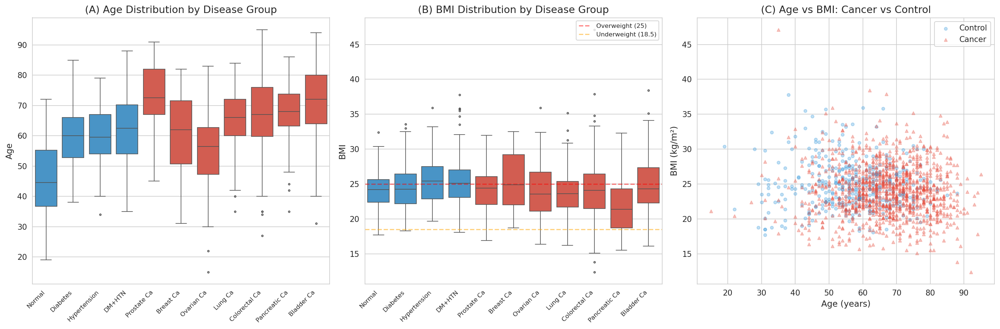
*Figure 2. (A) 질환군별 연령 분포 — 정상군(NOR, 45.3세)과 암 환자군(54–73세) 간 유의미한 연령 차이 확인. (B) BMI 분포 — 췌장암(PAN, 21.6)이 가장 낮고, 고혈압(HBP, 25.6)이 가장 높음. (C) Age vs BMI 산점도 — 암 환자(삼각형)가 대조군(원) 대비 고연령에 분포.*

**주요 관찰:**
- 정상군(NOR)의 평균 연령이 45.3세로 가장 낮음 → 암 환자군과의 연령 차이가 교란 변수로 작용 가능
- 전립선암(PRO)은 남성 전용, 유방암(BRE)/난소암(OVA)은 여성 전용
- 췌장암(PAN)의 BMI 21.6으로 가장 낮음 — 악액질(cachexia) 경향 반영 가능

---

## 4. 생활습관 (Lifestyle Factors)

### 4.1 흡연

| 상태 | 코드 | N | 비율 |
|---|---|---:|---|
| 비흡연 (Never) | 0 | 410 | 46.7% |
| 과거 흡연 (Former) | 1 | 270 | 30.8% |
| 현재 흡연 (Current) | 2 | 198 | 22.6% |
| **유효 소계** | | **878** | **100%** |
| 결측 (NA) | | 692 | |

### 4.2 음주

| 상태 | 코드 | N | 비율 |
|---|---|---:|---|
| 비음주 (Never) | 0 | 481 | 55.2% |
| 과거 음주 (Former) | 1 | 4 | 0.5% |
| 현재 음주 (Current) | 2 | 387 | 44.4% |
| **유효 소계** | | **872** | **100%** |
| 결측 (NA) | | 698 | |

> 기존에 미인코딩 상태였던 자유 텍스트(흡연 185건, 음주 179건)를 규칙 기반으로 100% 변환 완료.
> - `.`, `모름` → NULL (결측)
> - `안함` → 0 (비흡연/비음주)
> - `O`, `함(...)` → 2 (현재)
> - `Ex-smoker`, `quit`, `중단` 등 → 1 (과거 흡연)
> - `0.5갑/일 20Y` 등 팩년 기술 → 흡연자(1 또는 2)
> - `소주 2병/월 40Y` 등 음주량 기술 → 2 (현재 음주)

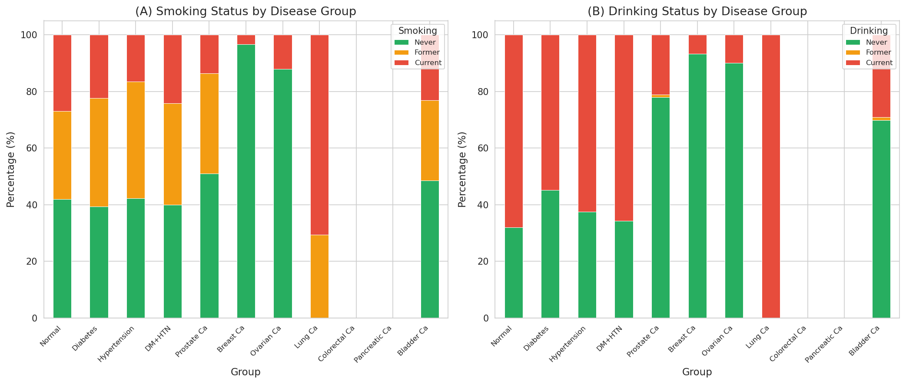
*Figure 3. 질환군별 흡연(A) 및 음주(B) 상태 분포. 유방암(BRE), 난소암(OVA)은 여성 전용 질환으로 비흡연 비율이 높음. 폐암(LUN)에서 현재 흡연자 비율이 가장 높음. 대장암(CRC), 췌장암(PAN)은 흡연/음주 데이터 미수집.*

---

## 5. 주요 검사 수치 (Laboratory Results)

### 5.1 전체 요약

| 검사 항목 | N | 평균 ± SD | 단위 |
|---|---:|---|---|
| **CBC** | | | |
| WBC | 799 | 6.64 ± 2.01 | 10³/uL |
| RBC | 799 | 4.55 ± 0.57 | 10⁶/uL |
| Hemoglobin | 799 | 14.01 ± 1.75 | g/dL |
| Hematocrit | 799 | 41.96 ± 8.13 | % |
| Platelet | 798 | 238.28 ± 58.88 | 10³/uL |
| **Chemistry** | | | |
| AST | 799 | 27.83 ± 17.63 | U/L |
| ALT | 799 | 27.58 ± 19.83 | U/L |
| ALP | 799 | 72.52 ± 28.38 | U/L |
| GGT | 621 | 36.65 ± 46.20 | U/L |
| BUN | 799 | 16.45 ± 5.85 | mg/dL |
| Creatinine | 798 | 0.97 ± 0.52 | mg/dL |
| Glucose | 796 | 119.69 ± 35.81 | mg/dL |
| Total Cholesterol | 798 | 174.23 ± 44.88 | mg/dL |
| Total Bilirubin | 799 | 0.79 ± 0.40 | mg/dL |
| Uric Acid | 799 | 5.46 ± 1.49 | mg/dL |
| Calcium | 798 | 9.50 ± 0.53 | mg/dL |
| Albumin | 400 | 4.61 ± 0.29 | g/dL |
| HbA1c | 487 | 6.30 ± 1.13 | % |
| **종양표지자** | | | |
| CEA | 475 | - | ng/mL |
| CA19-9 | 425 | - | U/mL |
| PSA | 298 | - | ng/mL |

> CEA/CA19-9는 SMCXD01 형식의 혈액검사 텍스트 필드에서 자동 파싱하여 추가로 75건(CEA), 25건(CA19-9)을 확보.

### 5.2 질환군별 주요 검사치

| 질환군 | WBC | Hb | AST | Glucose | T.Chol | HbA1c |
|---|---|---|---|---|---|---|
| NOR | 6.13±1.24 | 14.71±1.36 | 25.43±10.62 | 95.02±10.52 | 211.43±44.82 | 5.41±0.35 |
| DIA | 6.58±1.86 | 14.98±1.47 | 34.82±37.16 | 135.11±32.30 | 174.34±60.57 | 7.04±1.11 |
| HBP | 6.08±1.61 | 14.56±1.43 | 32.47±13.68 | 99.73±10.57 | 170.30±36.50 | 5.58±0.31 |
| H.D. | 6.65±1.72 | 14.67±1.60 | 32.06±15.61 | 136.09±38.89 | 152.41±31.65 | 6.92±0.97 |
| LUN | 6.97±2.64 | 13.07±1.34 | 22.12±11.35 | 125.59±34.49 | 179.51±38.63 | 6.39±0.97* |
| BLA | 6.92±2.16 | 13.35±1.82 | 25.23±10.03 | 122.07±39.89 | 168.59±39.55 | 6.58±1.38* |

> \* LUN HbA1c n=8, BLA HbA1c n=79로 표본 수 제한적

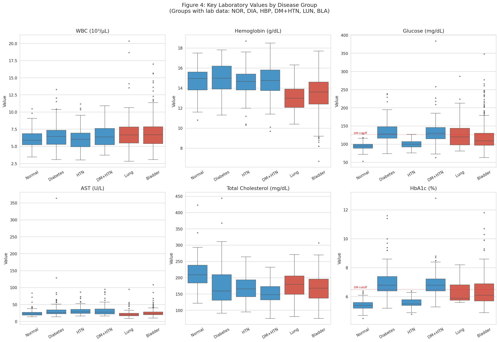
*Figure 4. 검사 데이터가 있는 6개 질환군의 주요 검사치 boxplot. 당뇨 진단 기준(glucose 126 mg/dL, HbA1c 6.5%)을 빨간 점선으로 표시. 당뇨(DIA) 및 당뇨+고혈압(H.D.)군의 glucose와 HbA1c가 진단 기준을 초과.*

**주요 관찰:**
- 정상군(NOR)은 glucose 95.0, HbA1c 5.41로 정상 범위
- 당뇨(DIA) 및 당뇨+고혈압(H.D.)군은 glucose 135–136, HbA1c 6.9–7.0로 당뇨 범위
- 폐암(LUN)의 Hb 13.07이 가장 낮아 빈혈 경향
- 정상군(NOR)의 총콜레스테롤 211.4가 가장 높음 (상대적으로 젊은 연령 반영 가능)

---

## 6. 암 관련 정보 (Cancer-specific Data)

### 6.1 병기/TNM 데이터 가용성

| 질환군 | N | Stage | TNM | T/N/M 개별 | 병리 | 진단명 | 치료이력 |
|---|---:|---|---|---|---|---|---|
| PRO | 100 | - | - | - | 90 | 100 | - |
| BRE | 30 | - | - | - | 30 | 30 | 30 |
| OVA | 70 | - | - | - | 30 | 70 | 30 |
| LUN | 300 | 253 | 264 | - | - | 300 | - |
| CRC | 300 | - | - | 30 | - | - | - |
| PAN | 70 | - | - | 70 | - | - | - |
| BLA | 300 | - | - | 299~300 | 300 | - | 300 |

- SMCXD01 형식(PRO/BRE/OVA/폐암1): 진단명과 병리 텍스트 중심, 정형화된 병기 코드 부족
- SMCXD06 형식(대장암/췌장암/방광암): T/N/M 개별 stage 코드 제공
- 폐암: 3개 원본 파일의 형식이 모두 다름 (폐암1=SMCXD01, 폐암2/3=SMCXD06)

### 6.2 검사 데이터 가용성

| 질환군 | CBC | Chemistry | 전해질 | Lipid | 종양표지자 | UA |
|---|---|---|---|---|---|---|
| NOR | 100% | 100% | 100% | 100% | 100% | 100% |
| DIA | 100% | 100% | 100% | 100% | 100% | 100% |
| HBP | 100% | 100% | 100% | 100% | 100% | 100% |
| H.D. | 100% | 100% | 100% | 100% | 100% | 100% |
| PRO | - | - | - | - | - | - |
| BRE | - | - | - | - | CEA 93% | - |
| OVA | - | - | - | - | CEA/CA19-9 36% | - |
| LUN* | 33% | 33% | 27% | 33% | CEA 7% | 11% |
| CRC | - | - | - | - | - | - |
| PAN | - | - | - | - | - | - |
| BLA | 100% | 부분 | 부분 | - | - | 100% |

> \* LUN의 구조화된 검사 데이터는 폐암3(100명)에서만 제공. BRE/OVA/LUN의 CEA/CA19-9는 혈액검사 텍스트에서 파싱.

### 6.3 수술/치료 정보 및 시료 채취 시점 (Sample Timing)

각 암종에 대해 시료 채취일(`sample_date`)과 수술일(`surgery_date`) 또는 진단일(`diagnosis_date`)의 차이를 계산하여 `sample_timing` 컬럼을 생성하였다.

**분류 기준:**
- `pre-op`: 수술/진단 **7일 이전** 채취
- `peri-op`: 수술/진단 **±7일 이내** 채취
- `post-op`: 수술/진단 **7일 이후** 채취
- `control`: 비암 대조군

| 암종 | N | pre-op | peri-op | post-op | unknown | 주요 시점 |
|---|---:|---:|---:|---:|---:|---|
| **BLA** | 300 | **198** (66%) | 61 | 41 | - | 수술 전 (treatment 텍스트에서 수술일 파싱) |
| **CRC** | 300 | 4 | **295** (98%) | 1 | - | 수술 당일 (실질적 pre-op) |
| **BRE** | 30 | **14** (47%) | 16 | - | - | 수술 전~진단 근접 |
| **OVA** | 70 | 8 | **60** (86%) | 2 | - | 진단 근접 |
| **PAN** | 70 | 6 | **53** (76%) | 11 | - | 수술 근접 (일부 post-op) |
| **LUN** | 300 | 3 | 121 | 6 | **170** | 혼재 (폐암1 날짜 미상) |
| **PRO** | 100 | - | 46 | **54** (54%) | - | 진단 후 (post-op 우세) |
| **Control** | 400 | - | - | - | - | N/A |
| **전체** | **1,570** | **233** | **652** | **115** | **170** | - |

**수술명 데이터 (surgery_name):** 460명 (29.3%)

| 암종 | 수술명 예시 |
|---|---|
| CRC | Left hemicolectomy, Low anterior resection, Right hemicolectomy |
| PAN | Pylorus preserving pancreaticoduodenectomy |
| LUN3 | ULobectomy, distal gastrectomy (기존 수술력) |

**암 모델링 시 시사점:**
- **Pre-op + Peri-op (885명)**: 수술/치료 전 시료 → SERS 바이오마커 탐색에 가장 적합
- **Post-op (115명)**: 치료 효과가 반영될 수 있음 → 별도 분석 또는 제외 고려
  - PRO(전립선암) 54명이 post-op → 이 그룹의 SERS 결과 해석 시 주의 필요
- **Unknown (170명)**: 폐암1(30명) + 폐암2(140명)의 날짜 미상 → 원본 확인 필요

---

## 7. 컬럼 카테고리별 충족률 (Data Completeness)

| 카테고리 | 컬럼 수 | 평균 충족률 | 범위 |
|---|---:|---|---|
| Demographics | 7 | 76.3% | 44.5% – 100.0% |
| Lifestyle | 2 | 55.7% | 55.5% – 55.9% |
| History | 1 | 83.9% | 83.9% |
| Diagnosis/Cancer | 13 | 31.9% | 6.8% – 89.2% |
| **Surgery/Treatment (신규)** | **4** | **29.8%** | **0.1% – 89.2%** |
| CBC | 7 | 50.9% | 50.8% – 50.9% |
| Chemistry | 14 | 42.8% | 25.5% – 50.9% |
| Electrolytes | 3 | 33.8% | 21.1% – 40.1% |
| Lipid | 4 | 32.5% | 25.5% – 50.8% |
| Diabetes | 1 | 31.0% | 31.0% |
| Tumor Markers | 4 | 25.5% | 19.0% – 30.3% |
| Urinalysis | 5 | 45.1% | 44.2% – 46.4% |

> **신규 컬럼:** `surgery_name`(29.3%), `chemo_date`(1.1%), `treatment_detail`(0.1%), `sample_timing`(89.2%)

- 검사 데이터(CBC/Chemistry)의 전체 충족률이 ~50%인 이유: SMCXD01 형식(PRO/BRE/OVA/폐암1)과 SMCXD06 일부(CRC/PAN)에는 검사 데이터가 포함되지 않음
- SMCXD03/05(비암군 400명)와 방광암(300명)은 대부분 항목에서 100% 충족

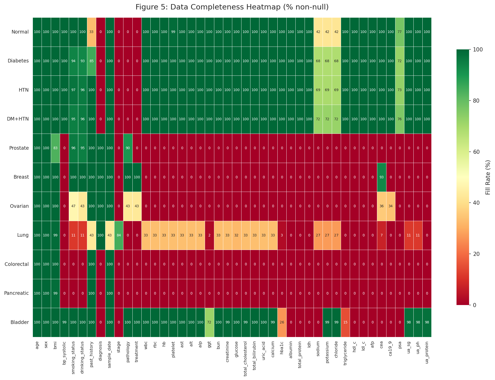
*Figure 5. 질환군(행) × 44개 주요 변수(열)의 충족률 히트맵. 녹색=100%, 노랑=부분, 빨강=0%. 비암 대조군 4종과 방광암(BLA)의 검사 데이터가 가장 풍부. SMCXD01 형식(PRO/BRE/OVA)은 CBC/Chemistry 전체가 비어 있음.*

---

## 8. SERS 스펙트럼-임상 데이터 연결 (SERS-Clinical Linkage)

### 8.1 매칭 방법

SERS 스펙트럼 데이터(`processed_spectra.csv`)의 `group + sample_id` 조합을 임상 데이터의 `patient_id`와 연결하였다.

| 매칭 유형 | 대상 질환군 | 방법 |
|---|---|---|
| 직접 매칭 | NOR, DIA, HBP, LUN, CRC, PRO | `"{group} {sample_id}"` == `patient_id` |
| 그룹명 변환 | PAN (CPAN) | SERS `"CPAN"` → 임상 `"CPAN"` |
| 공백 정규화 | H.D. | SERS `"H.D."` → 임상 `"H. D."` |
| 순서 기반 | BRE, OVA | SERS sample 1..N → 임상 레코드 순서 (동일 환자 수) |

### 8.2 매칭 결과

| 질환군 | SERS 환자 | 임상 매칭 | 매칭률 |
|---|---:|---:|---|
| NOR | 100 | 100 | 100% |
| DIA | 100 | 100 | 100% |
| HBP | 100 | 100 | 100% |
| H.D. | 100 | 100 | 100% |
| PRO | 100 | 100 | 100% |
| BRE | 30 | 30 | 100% |
| OVA | 70 | 70 | 100% |
| LUN | 300 | 200 | 67% |
| CRC | 300 | 300 | 100% |
| PAN (CPAN) | 70 | 70 | 100% |
| SPAN | 72 | 0 | - |
| UNK | 2 | 0 | - |
| **전체** | **1,344** | **1,170** | **87%** |

> LUN 100명 미매칭: 폐암3(100명)의 임상 patient_id가 병원코드 형식(예: `24732410`)으로, SERS의 순번 ID(`LUN 201`~`LUN 300`)와 직접 매칭 불가.
> SPAN(72명), UNK(2명)는 임상 데이터 미수집 그룹.

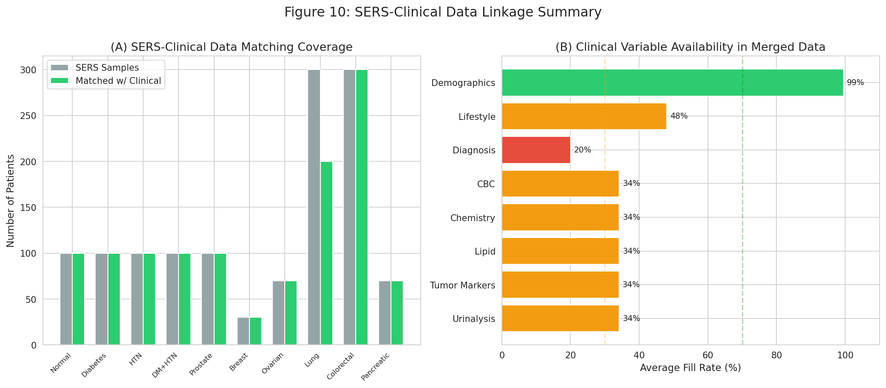
*Figure 10. (A) 질환군별 SERS-임상 매칭 현황 — LUN에서 100명 미매칭 발생. (B) 매칭된 데이터의 임상 변수 가용성 — Demographics 99%, CBC/Chemistry/Lipid 34%, Diagnosis 20%.*

### 8.3 SERS 스펙트럼 특성

SERS 스펙트럼에서 환자당 평균 스펙트럼을 계산하고, 10개의 aggregate feature를 추출하였다.

| 특성 | 설명 |
|---|---|
| peak_intensity | 최대 피크 강도 (log-scale) |
| total_intensity | 전체 면적 적분 |
| mean_intensity | 평균 강도 |
| std_intensity | 강도 표준편차 (replicate 간 변동) |
| band_600_650 | C-S stretch 영역 평균 |
| band_720_760 | C-N stretch 영역 평균 |
| band_1000_1050 | Phenylalanine 영역 평균 |
| band_1200_1300 | Amide III 영역 평균 |
| band_1400_1500 | CH₂ deformation 영역 평균 |
| band_1600_1700 | Amide I / C=C 영역 평균 |

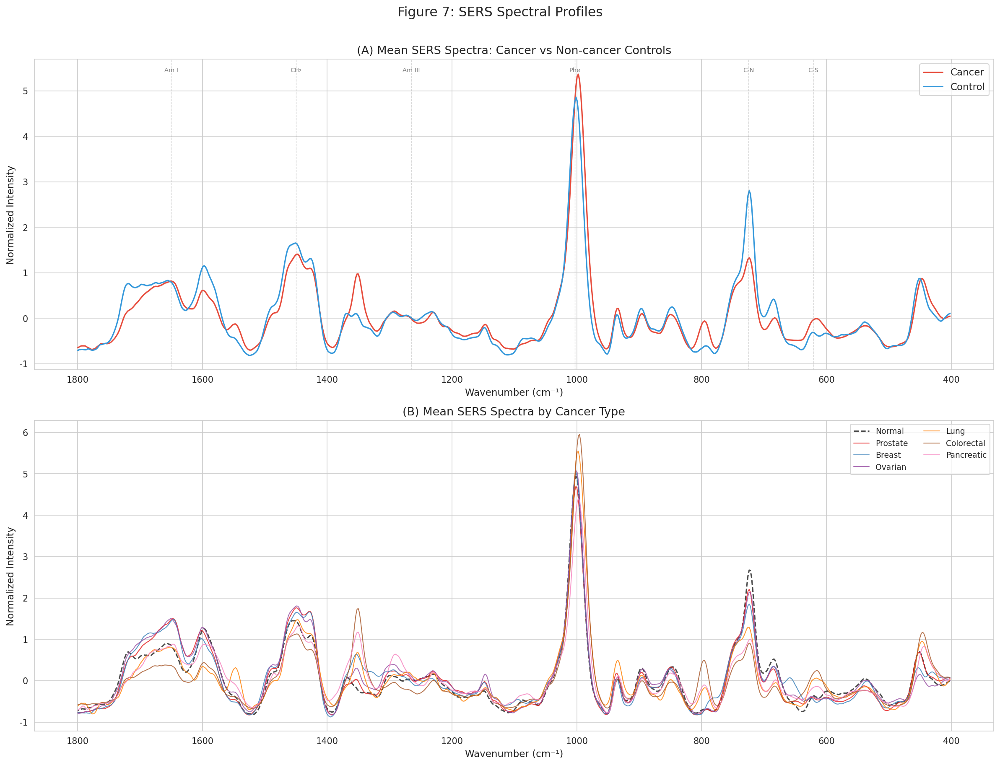
*Figure 7. (A) 암 vs 비암 대조군의 평균 SERS 스펙트럼. 주요 밴드(C-S, C-N, Phenylalanine, Amide III, CH₂, Amide I) 위치 표시. 1000 cm⁻¹ 부근 Phenylalanine 피크에서 암 그룹이 더 높은 강도. (B) 암종별 평균 스펙트럼 비교. CRC(대장암)와 LUN(폐암)이 가장 높은 피크 강도를 보임.*

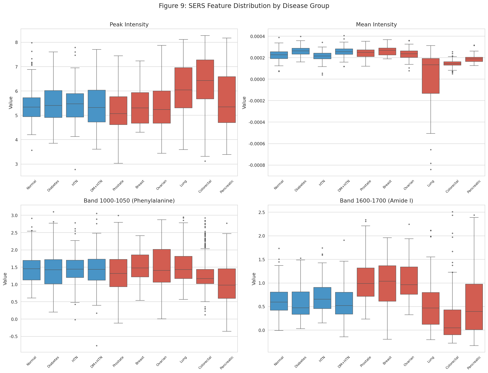
*Figure 9. 질환군별 SERS feature 분포. (좌상) Peak Intensity: CRC가 가장 높고, PRO가 가장 낮음. (좌하) Phenylalanine band: 암 그룹 간 변동 큼. (우하) Amide I band: 암 그룹에서 분산이 더 넓음.*

---

## 9. SERS-임상 상관관계 분석 (Correlation Analysis)

### 9.1 상관 히트맵

10개 SERS 특성과 22개 임상 검사값 간의 Pearson 상관계수를 계산하였다.

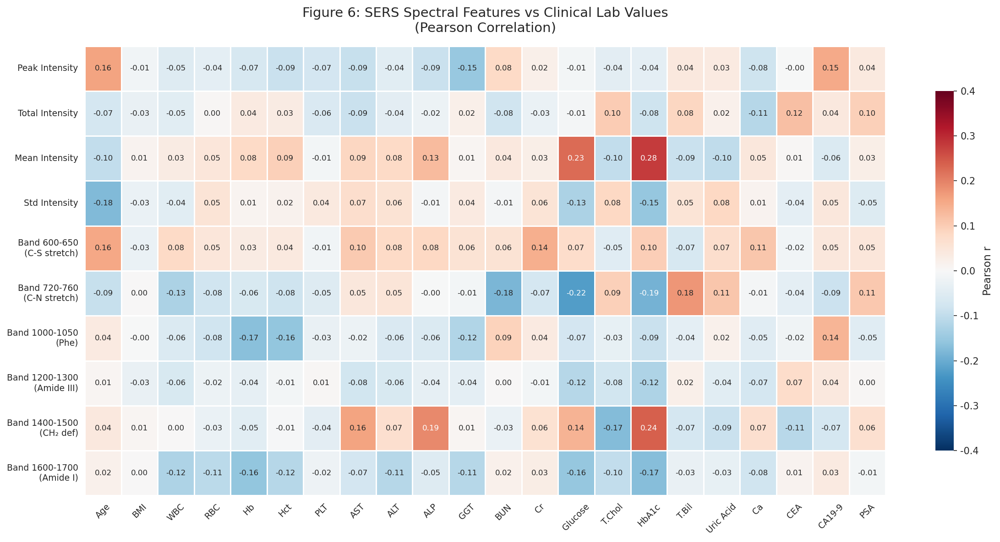
*Figure 6. SERS 스펙트럼 특성(행) vs 임상 검사값(열) Pearson 상관계수 히트맵. 빨강=양의 상관, 파랑=음의 상관. 가장 강한 상관은 Mean Intensity ↔ HbA1c (r=+0.28).*

### 9.2 주요 상관관계 (|r| > 0.15)

| SERS 특성 | 임상 변수 | r | p-value | n |
|---|---|---:|---|---:|
| **Mean Intensity** | **HbA1c** | **+0.281** | **1.1e-08** | **400** |
| **Mean Intensity** | **Glucose** | **+0.227** | **4.3e-06** | **400** |
| **Band 1400-1500 (CH₂)** | **HbA1c** | **+0.238** | **1.5e-06** | **400** |
| **Band 720-760 (C-N)** | **Glucose** | **-0.223** | **6.6e-06** | **400** |
| Band 1400-1500 (CH₂) | ALP | +0.191 | - | 400 |
| Band 720-760 (C-N) | HbA1c | -0.190 | - | 400 |
| Band 720-760 (C-N) | BUN | -0.182 | - | 400 |
| Std Intensity | Age | -0.177 | - | 1170 |
| Band 720-760 (C-N) | T.Bilirubin | +0.177 | - | 400 |
| Band 1400-1500 (CH₂) | T.Cholesterol | -0.175 | - | 400 |
| Band 1000-1050 (Phe) | Hb | -0.166 | - | 400 |
| Peak Intensity | Age | +0.160 | - | 1170 |
| Band 1400-1500 (CH₂) | AST | +0.160 | - | 400 |

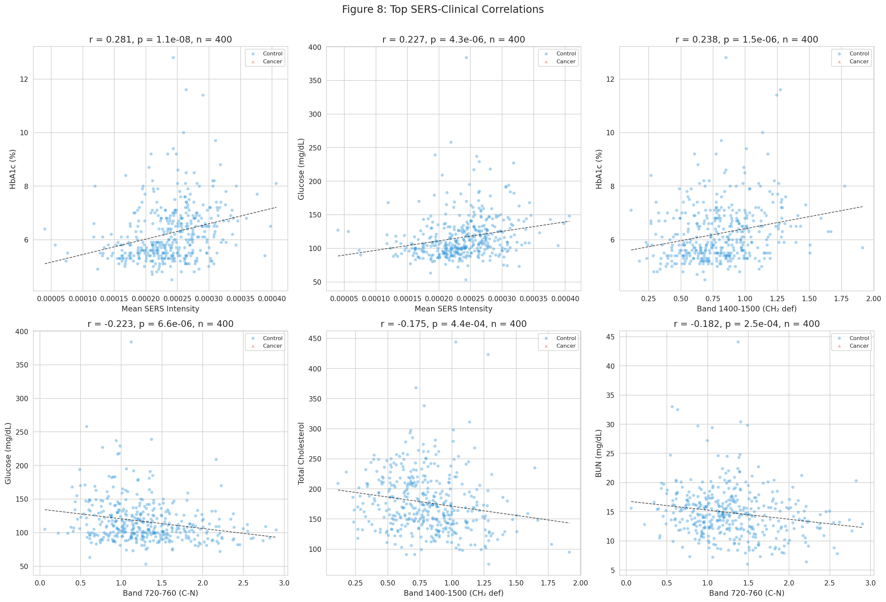
*Figure 8. 상관관계가 가장 높은 6쌍의 산점도. (좌상) Mean SERS Intensity vs HbA1c: r=+0.281, p=1.1e-08 — SERS 신호 강도가 당화혈색소와 양의 상관. (중상) Mean Intensity vs Glucose: r=+0.227. (우상) CH₂ band vs HbA1c: r=+0.238. 대조군(파란 원)이 대다수이며, 암 환자(빨간 삼각)의 검사 데이터는 제한적.*

### 9.3 해석

**당뇨/대사 관련 상관:**
- SERS mean intensity와 CH₂ deformation band(1400-1500 cm⁻¹)가 HbA1c(r=+0.28, +0.24) 및 glucose(r=+0.23)와 양의 상관을 보임
- 이는 소변 내 당 관련 대사산물이 SERS 신호에 반영될 가능성을 시사
- C-N stretch band(720-760 cm⁻¹)는 glucose(r=-0.22) 및 HbA1c(r=-0.19)와 음의 상관 → 대사 상태에 따른 단백질 조성 변화 반영 가능

**한계:**
- 상관계수 크기가 |r| < 0.3으로, 설명력(R²)은 최대 8% 수준
- 검사 데이터가 있는 환자(n=400)가 대부분 비암 대조군 → 암 환자의 SERS-임상 상관은 별도 분석 필요
- 관찰된 상관이 인과관계를 의미하지 않으며, 연령/성별/질환군 등의 교란 변수 보정이 필요

---

## 10. 데이터 품질 이슈 및 해결 현황 (Data Quality)

| 이슈 | 상태 | 조치 내용 |
|---|---|---|
| PRO 신장/체중 역전 | **해결** | height_cm ↔ weight_kg 자동 스왑, BMI 재계산 (24.4±2.9) |
| 흡연/음주 미인코딩 (185건+179건) | **해결** | 규칙 기반 변환: `.`→NULL, `안함`→0, `O`/`함`→2, `Ex-smoker`→1 등 |
| SMCXD01 혈액검사 텍스트 파싱 | **해결** | `parse_blood_test_text()` 함수로 CEA +75건, CA19-9 +25건 추출 |
| SERS-임상 데이터 연결 | **해결** | 1,170/1,344명(87%) 매칭, 상관분석 수행 |
| LUN 폐암3 병원코드 ID 미매칭 | **미해결** | 폐암3의 patient_id가 병원코드 형식, SERS ID와 매핑 테이블 필요 |
| BLA 방광암 SERS 데이터 없음 | **해당 없음** | SERS 스펙트럼에 BLA 그룹 미포함 |
| SPAN 그룹 (72명) | **미확인** | SERS에만 존재, 임상 데이터 및 질환군 확인 필요 |

---

## 11. 표준화 컬럼 스키마 (Standardized Schema)

총 68개 컬럼, 12개 카테고리:

| 카테고리 | 컬럼 | 설명 |
|---|---|---|
| **식별** | patient_id, disease_group, source_file | 환자 식별 및 원본 추적 |
| **인구통계** | age, sex, height_cm, weight_kg, bmi, bp_systolic, bp_diastolic | |
| **생활습관** | smoking_status (0/1/2), drinking_status (0/1/2) | |
| **병력** | past_history | 자유 텍스트 |
| **진단** | diagnosis, diagnosis_date, sample_date, surgery_date, pathology, stage, tnm, t_stage, n_stage, m_stage, metastasis, treatment, fasting | |
| **수술/치료 (신규)** | surgery_name, chemo_date, treatment_detail, sample_timing | 수술명, 항암 시작일, 치료 유형, 시료 채취 시점 |
| **CBC** | wbc, rbc, hb, hct, platelet, neutrophil_pct, lymphocyte_pct | |
| **Chemistry** | ast, alt, alp, ggt, bun, creatinine, uric_acid, glucose, total_protein, albumin, total_bilirubin, ldh, calcium, hs_crp | |
| **전해질** | sodium, potassium, chloride | |
| **지질** | total_cholesterol, triglyceride, hdl_c, ldl_c | |
| **당뇨** | hba1c | |
| **종양표지자** | afp, cea, ca19_9, psa | |
| **요검사** | ua_sg, ua_ph, ua_protein, ua_glucose, ua_blood | |

### 인코딩 규칙

| 필드 | 인코딩 |
|---|---|
| sex | M / F |
| smoking_status | 0=비흡연, 1=과거흡연, 2=현재흡연 |
| drinking_status | 0=비음주, 1=과거음주, 2=현재음주 |
| sample_timing | pre-op / peri-op / post-op / control |
| 날짜 필드 | YYYY-MM-DD |
| 수치 필드 | float (결측=NULL) |

---

## 12. 파일 목록 (Output Files)

```
data/clinical_data/standardized/
├── all_clinical_standardized.csv          # 통합 임상 (1,570 × 64)
├── {GROUP}_clinical_standardized.csv      # 질환별 임상 (11개)
├── sers_clinical_merged.csv               # SERS+임상 통합 (1,170 × 78)
├── sers_patient_features.csv              # SERS 환자별 특성 (1,344 × 15)
├── sers_clinical_correlation.csv          # 상관계수 행렬 (10 × 22)
├── clinical_data_report_draft.md          # 본 보고서
└── figures/
    ├── fig1_population_overview.png       # 연구 대상 개요
    ├── fig2_demographics.png              # 인구통계 (연령/BMI)
    ├── fig3_lifestyle.png                 # 생활습관 (흡연/음주)
    ├── fig4_lab_values.png                # 주요 검사치
    ├── fig5_completeness_heatmap.png      # 데이터 충족률 히트맵
    ├── fig6_sers_clinical_correlation.png  # SERS-임상 상관 히트맵
    ├── fig7_sers_spectra.png              # SERS 스펙트럼 프로파일
    ├── fig8_sers_clinical_scatter.png     # 주요 상관 산점도
    ├── fig9_sers_features_by_group.png    # 질환군별 SERS 특성
    └── fig10_linkage_summary.png          # SERS-임상 연결 요약
```

---

## 13. 향후 과제 (Next Steps)

1. **폐암3 SERS-임상 ID 매핑** — 병원코드(예: `24732410`) ↔ SERS 순번(예: `LUN 201`) 매핑 테이블 확보
2. **SPAN 그룹 확인** — SERS에만 존재하는 72명의 질환군 및 임상 데이터 확인
3. **교란 변수 보정** — 연령(NOR 45.3세 vs 암 65-73세), 성별 등의 교란 변수에 대한 다변량 분석
4. **암 환자 검사 데이터 보강** — SMCXD01 형식(PRO/BRE/OVA) 환자의 추가 검사 데이터 확보 가능성 검토
5. **SERS-임상 다변량 모델** — 단변량 상관을 넘어 다중 회귀/PLS 분석으로 임상 변수 예측 모델 구축
6. **방광암(BLA) SERS 데이터 확보** — 300명의 풍부한 임상 데이터를 활용하기 위해 SERS 측정 필요

---

## 14. 대사물질 Raman 스펙트럼 분석 (Metabolite Raman Spectral Analysis)

> **전체 보고서:** [`/metabolite_profiling/METABOLITE_PROFILING_REPORT.md`](../../../metabolite_profiling/METABOLITE_PROFILING_REPORT.md)
> 데이터/그래프: `/metabolite_profiling/data/`, `/metabolite_profiling/figures/`

### 14.1 개요

SERS 소변 스펙트럼의 주요 피크에 대한 분자 수준의 해석을 위해, 73종의 소변 관련 대사물질을 Thermo Raman 분광기로 개별 측정하였다. 각 물질당 5–6회 반복 측정 후 평균 스펙트럼을 산출하고, SERS 소변 스펙트럼과의 피크 매칭 및 스펙트럼 유사도 분석을 수행하였다.

| 항목 | 값 |
|---|---|
| 측정 대사물질 수 | **73종** |
| 반복 측정 횟수 | 물질당 5–6회 |
| 총 스펙트럼 파일 | 439개 CSV |
| 분석 파수 영역 | 400–1800 cm⁻¹ (fingerprint region) |
| SERS 주요 피크 수 | 17개 검출 |
| 피크-대사물질 매칭 | 527쌍 (±10 cm⁻¹ 이내) |

**측정 대사물질 카테고리:**
- **아미노산** (14종): Alanine, Arginine, Aspartic acid, Cysteine, Glutamic acid, Glycine, Histidine, Isoleucine, Leucine, Phenylalanine, Proline, Serine, Threonine, Tryptophan, Tyrosine, Valine
- **핵산/뉴클레오시드** (9종): Adenine, Adenosine, Guanine, Hypoxanthine, Inosine, Pseudouridine, Purine, Pyrimidine, Uracil, Xanthine
- **유기산** (10종): Acrylic acid, Ascorbic acid, Benzoic acid, cis/trans-Aconitic acid, Hippuric acid, Maleic acid, Malic acid, Uric acid, Xylonic acid
- **지질/지방산** (4종): Cholesterol, Palmitic acid, Sphinganine, Stearic acid
- **당류** (5종): Fucose, Galactosamine, Glucose, Glycogen, Xylose
- **기타** (10종): 8-Hydroxy-2-deoxyguanosine, Betaine, Choline, Creatine, Creatinine, Kynurenine, NADH, O-Acetylcarnitine, Spermidine, Trimethylamine-N-oxide 등

### 14.2 SERS 소변 스펙트럼과의 유사도

73종 대사물질 스펙트럼과 평균 SERS 소변 스펙트럼 간의 Pearson 상관계수를 계산하였다.

| 순위 | 대사물질 | Pearson r | 생물학적 의미 |
|---|---|---:|---|
| 1 | **2-Phenylacetamide** | 0.776 | 페닐알라닌 대사산물, 장내 미생물 |
| 2 | **Hippuric acid** | 0.764 | 소변 주요 유기산, 장내 미생물 대사 |
| 3 | **Stearic acid** | 0.694 | 포화지방산 (C18:0) |
| 4 | **Phenylalanine** | 0.661 | 필수 아미노산, 1003 cm⁻¹ 피크 주역 |
| 5 | **Palmitic acid** | 0.639 | 포화지방산 (C16:0) |
| 6 | **Adenosine** | 0.627 | 뉴클레오시드, 에너지 대사 |
| 7 | **Trimethylamine-N-oxide** | 0.620 | 장내 미생물 대사, 심혈관 위험 마커 |
| 8 | **Benzoic acid** | 0.600 | 방향족 대사, hippuric acid 전구체 |
| 9 | **Cholesterol** | 0.590 | 지질 대사 |
| 10 | **Ascorbic acid** | 0.580 | 비타민 C, 항산화 |

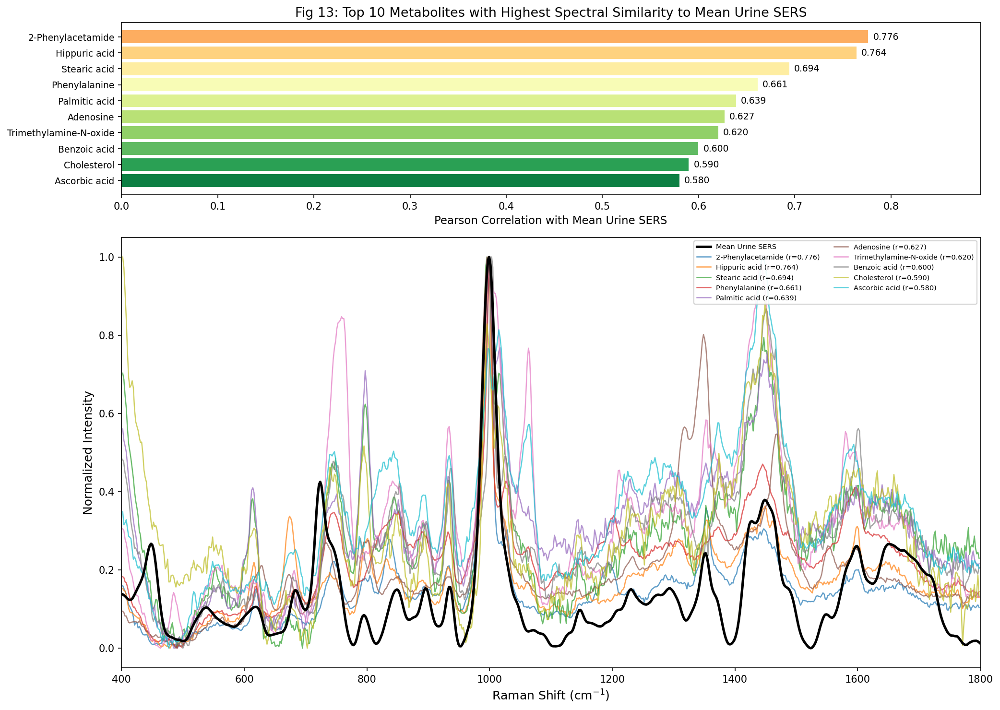
*Figure 13. (상) SERS 소변 스펙트럼과 Pearson 상관계수가 가장 높은 10종 대사물질. 2-Phenylacetamide(r=0.776)와 Hippuric acid(r=0.764)가 소변 SERS 신호의 주요 기여 물질. (하) Top 10 대사물질 스펙트럼과 평균 SERS 소변 스펙트럼(검은 선) 오버레이.*

**해석:**
- **2-Phenylacetamide**와 **Hippuric acid**가 가장 높은 유사도 → 소변 SERS 신호의 주요 기여 물질
- 두 물질 모두 phenylalanine 대사 경로의 산물이며, 장내 미생물(gut microbiome)에 의해 생성
- **Stearic/Palmitic acid**의 높은 유사도는 지질 대사 관련 신호 기여를 시사
- **TMAO**(Trimethylamine-N-oxide)는 장내 미생물 유래 대사물질로, 심혈관 질환과의 연관성이 보고된 바이오마커

### 14.3 주요 SERS 밴드별 피크 할당 (Peak Assignment)

SERS 소변 스펙트럼에서 검출된 17개 주요 피크에 대해, 각 피크와 ±10 cm⁻¹ 이내에서 매칭되는 대사물질을 식별하였다.

| SERS 피크 (cm⁻¹) | 진동 모드 | 주요 기여 대사물질 |
|---|---|---|
| **618** | C-S stretch | Cysteine, Adenine, Betaine, Cholesterol, Arginine |
| **683** | C-S stretch / Tyrosine | Adenine, Guanine, Purine, Hippuric acid |
| **724** | C-N stretch / Adenine ring | Adenine, Hypoxanthine, Hippuric acid, Benzoic acid |
| **849** | Tyrosine ring breathing | Tyrosine, Tryptophan, Creatinine |
| **999** | **Phenylalanine ring breathing** | **Phenylalanine**, 2-Phenylacetamide, Benzoic acid, Hippuric acid |
| **1148** | C-N stretch | Glycogen, Glucose, Xylose |
| **1231** | Amide III | 다수 (Threonine, Taurine, Isoleucine, Malic acid 등) |
| **1293** | Amide III / CH₂ twist | O-Acetylcarnitine, Acrylic acid, Palmitic acid |
| **1352** | CH deformation / Trp | Adenine, Guanine, Tryptophan |
| **1449** | CH₂ deformation | 거의 모든 대사물질 (비특이적) |
| **1597** | C=C stretch / Purine ring | Adenine, Kynurenine, Tyrosine, Phenylalanine |
| **1651** | Amide I (C=O stretch) | Maleic acid, Glycogen, Kynurenine, Stearic acid |

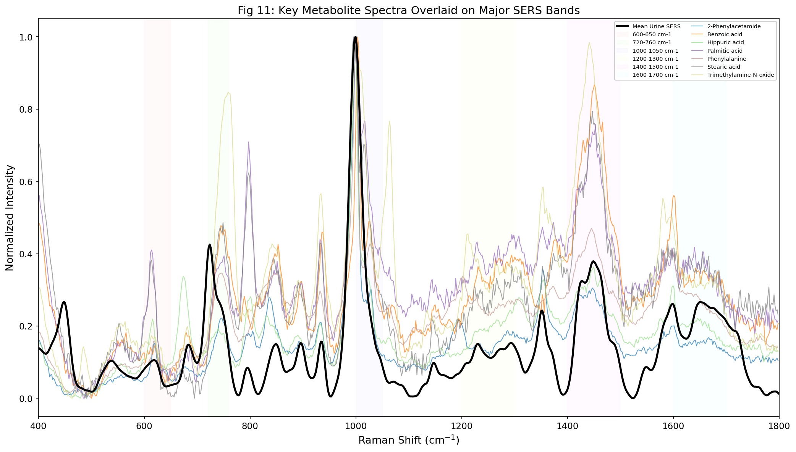
*Figure 11. 주요 SERS 밴드 영역(색상 음영)에 대응하는 대사물질 스펙트럼 오버레이. 검은 선=평균 SERS 소변 스펙트럼. 각 대사물질의 피크 위치가 SERS 밴드와 일치하는 영역을 시각적으로 확인 가능.*

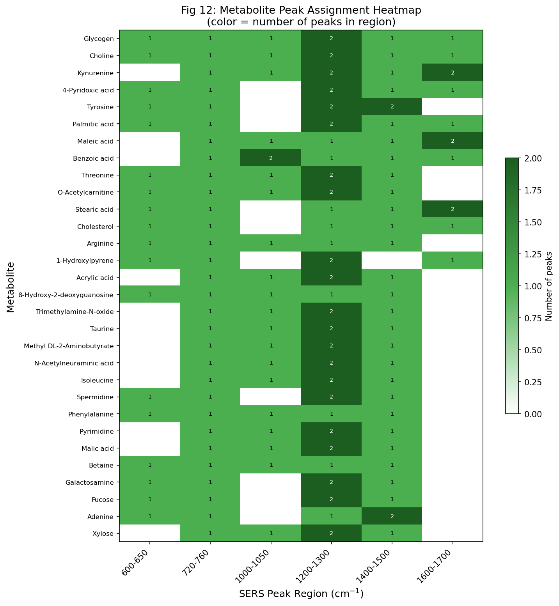
*Figure 12. 대사물질(행) × SERS 피크 영역(열) 피크 할당 히트맵. 색상 강도=해당 영역 내 대사물질 피크 수. 1200-1300 cm⁻¹(Amide III) 영역에서 가장 많은 대사물질이 피크를 보이며, 1400-1500 cm⁻¹(CH₂)은 거의 모든 물질이 기여하는 비특이적 밴드.*

### 14.4 암 탐지 관련 시사점

| 대사물질 | 암 관련성 | SERS 기여 밴드 |
|---|---|---|
| **Hippuric acid** | 장내 미생물 변화 → 대장암, 방광암 바이오마커 후보 | 724, 999, 1597 cm⁻¹ |
| **Kynurenine** | 트립토판 분해 경로, IDO 효소 과발현 (면역 회피) | 1597, 1651 cm⁻¹ |
| **TMAO** | 전립선암, 대장암 위험 증가 관련 | 750, 1449 cm⁻¹ |
| **Adenine/Adenosine** | 핵산 대사 변화, 세포 증식 마커 | 618, 724, 1352, 1597 cm⁻¹ |
| **Spermidine** | 폴리아민 경로, 종양 세포 증식 마커 | 1231 cm⁻¹ |
| **N-Acetylneuraminic acid** | 시알산, 암세포 표면 당쇄 변화 마커 | 1231, 1449 cm⁻¹ |
| **8-Hydroxy-2-deoxyguanosine** | 산화적 DNA 손상 마커 | 618, 1449 cm⁻¹ |

이들 대사물질의 SERS 밴드 기여를 통해, 소변 SERS 스펙트럼에서 관찰되는 암/비암 간 차이가 특정 대사 경로의 변화를 반영할 수 있음을 확인하였다.

### 14.5 암 vs 대조군 — 대사물질 밴드별 통계 검정

대사물질 Raman 피크 정보를 기반으로 10개의 생물학적 의미가 있는 밴드를 정의하고, 암 환자(870명) vs 비암 대조군(400명)의 SERS 신호 강도를 비교하였다.

| 밴드 | 파수 (cm⁻¹) | 대사물질 할당 | Cohen's d | 방향 | p-value |
|---|---|---|---:|---|---|
| **Creatinine** | 680–690 | Creatinine, Guanine | **-1.26** | Cancer DOWN | 2.9e-83 |
| **Adenine** | 720–730 | Adenine, Hypoxanthine | **-1.13** | Cancer DOWN | 1.4e-72 |
| **Hippuric acid** | 790–800 | Hippuric acid, Kynurenine | **+1.09** | Cancer UP | 4.9e-52 |
| **Purine/C=C** | 1590–1605 | Adenine, Kynurenine, Tyrosine | **-0.93** | Cancer DOWN | 1.9e-43 |
| **C-S stretch** | 615–625 | Cysteine, thiol compounds | **+0.76** | Cancer UP | 1.1e-28 |
| **Tyr/Trp** | 845–855 | Tyrosine, Tryptophan | **-0.43** | Cancer DOWN | 4.1e-11 |
| **CH₂ def** | 1440–1460 | Lipids, fatty acids | **-0.38** | Cancer DOWN | 7.6e-09 |
| Amide III | 1225–1300 | Tryptophan, Kynurenine | -0.09 | ns | 0.13 |
| Phe ring | 999–1010 | Phenylalanine | -0.05 | ns | 0.37 |
| Amide I | 1645–1660 | Kynurenine, Glycogen | +0.01 | ns | 0.86 |

> 7/10 밴드에서 유의미한 차이 (p < 0.05). 최대 효과 크기: Creatinine band (d=-1.26).

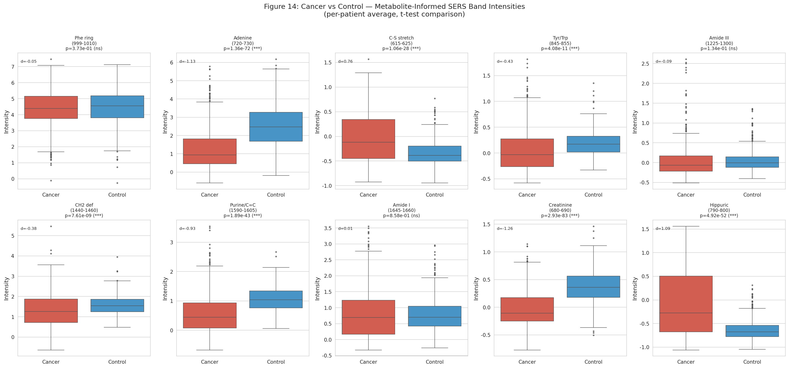
*Figure 14. 대사물질 기반 10개 SERS 밴드의 암/대조군 비교. 7개 밴드에서 통계적으로 유의미한 차이. Creatinine(680-690), Adenine(720-730) 밴드는 암 환자에서 감소(d=-1.26, -1.13), Hippuric acid(790-800) 밴드는 암 환자에서 증가(d=+1.09).*

**해석:**
- **Creatinine(680-690 cm⁻¹) 감소 (d=-1.26):** 가장 큰 효과 크기. 암 환자의 소변 내 크레아티닌 관련 신호 감소는 신장 기능 변화 또는 근육 대사 변화를 반영 가능
- **Adenine(720-730 cm⁻¹) 감소 (d=-1.13):** 핵산 대사 변화. 종양에 의한 purine 소비 증가로 소변 배출 감소 가능
- **Hippuric acid(790-800 cm⁻¹) 증가 (d=+1.09):** 장내 미생물 대사 변화. 암 환자에서 gut dysbiosis가 hippuric acid 배출 증가를 초래
- **C-S stretch(615-625 cm⁻¹) 증가 (d=+0.76):** thiol 화합물 증가. 암 세포의 산화 스트레스 대응에 의한 cysteine/glutathione 변화 시사

### 14.6 질환군별 대사물질 밴드 프로파일

각 질환군의 대사물질 밴드 강도를 Z-score 정규화하여 비교하였다.

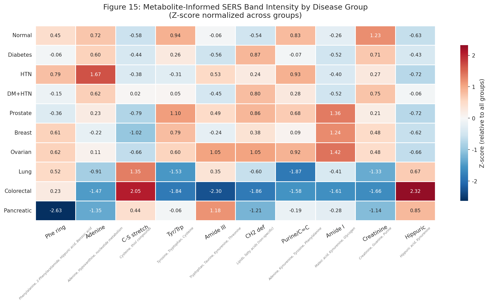
*Figure 15. 질환군(행) × 대사물질 밴드(열) Z-score 히트맵. 빨강=상대적 증가, 파랑=감소. 각 밴드 아래에 할당된 대사물질 표시. 대장암(CRC)과 췌장암(PAN)은 대부분의 밴드에서 감소(파란색) 경향, 전립선암(PRO)과 난소암(OVA)은 Amide I 밴드에서 특이적 증가.*

**질환군별 특이적 패턴:**

| 질환군 | 특이적 증가 밴드 | 특이적 감소 밴드 | 해석 |
|---|---|---|---|
| **CRC (대장암)** | Hippuric acid (+2.32) | Amide III (-2.30), CH₂ (-1.86) | 장내 미생물 대사 변화가 가장 뚜렷 |
| **PAN (췌장암)** | Amide III (+1.18), Hippuric (+0.85) | Phe ring (-2.63), Adenine (-1.35) | 악액질에 의한 아미노산/핵산 고갈 |
| **LUN (폐암)** | C-S stretch (+1.35), Hippuric (+0.67) | Tyr/Trp (-1.53), Purine (-1.87) | 산화 스트레스 증가 + 방향족 아미노산 감소 |
| **PRO (전립선)** | Tyr/Trp (+1.10), Amide I (+1.36) | C-S stretch (-0.79) | 단백질 관련 신호 증가 |
| **OVA (난소암)** | Amide III (+1.05), Amide I (+1.42) | C-S stretch (-0.66) | Amide 밴드 특이적 증가 |
| **BRE (유방암)** | Tyr/Trp (+0.79), Amide I (+1.24) | C-S stretch (-1.02) | 전립선/난소와 유사한 단백질 패턴 |

### 14.7 차이 스펙트럼과 대사물질 할당

암 vs 대조군 차이 스펙트럼(Cancer − Control)에 대사물질 피크를 주석으로 표시하였다.

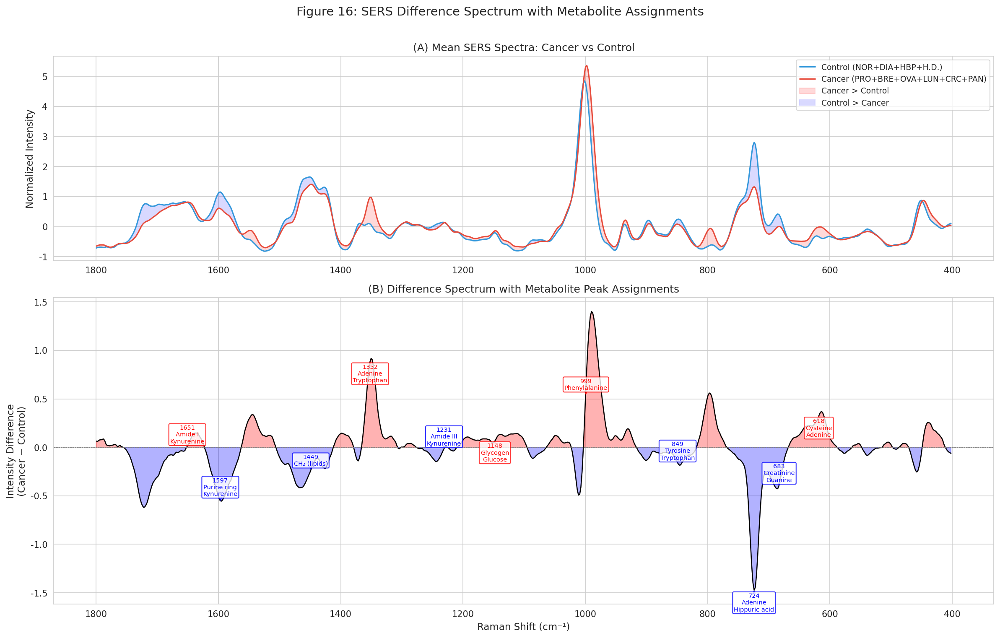
*Figure 16. (A) 암 vs 대조군 평균 SERS 스펙트럼 오버레이. 빨강 음영=암 환자 신호 증가 영역, 파랑 음영=감소 영역. (B) 차이 스펙트럼(Cancer−Control)에 대사물질 피크 할당. 999 cm⁻¹(Phenylalanine), 1352 cm⁻¹(Adenine/Tryptophan), 618 cm⁻¹(Cysteine/Adenine)에서 암 환자 신호 증가. 724 cm⁻¹(Adenine/Hippuric acid), 1597 cm⁻¹(Purine ring), 683 cm⁻¹(Creatinine)에서 감소.*

### 14.8 암종별 차이 스펙트럼

각 암종의 정상군(NOR) 대비 차이 스펙트럼을 비교하였다.

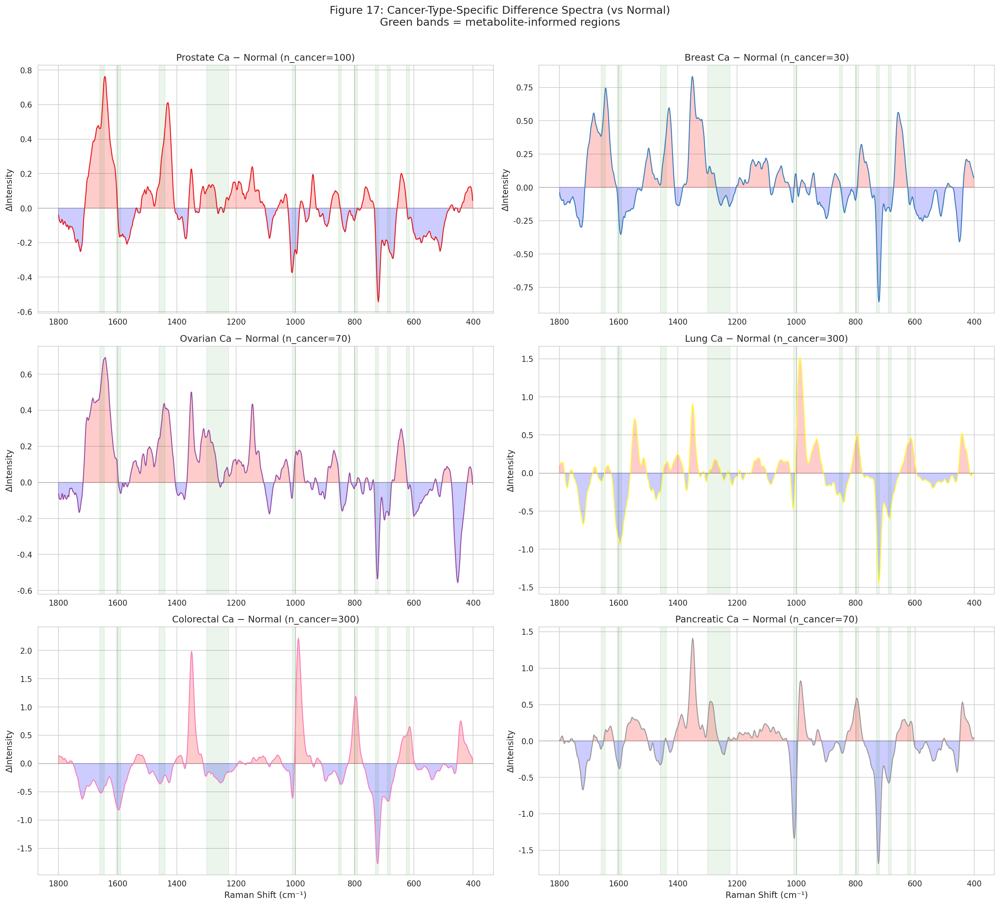
*Figure 17. 6개 암종의 정상군 대비 차이 스펙트럼. 녹색 음영=대사물질 기반 분석 밴드 영역. 전립선암(PRO)은 1600 cm⁻¹ 부근에서 뚜렷한 증가, 대장암(CRC)은 1350 cm⁻¹에서 강한 양성 피크, 췌장암(PAN)은 전반적 감소 패턴이 특징적.*

---

## 15. 파일 목록 (Output Files) — 업데이트

```
data/clinical_data/standardized/
├── all_clinical_standardized.csv              # 통합 임상 (1,570 × 64)
├── {GROUP}_clinical_standardized.csv          # 질환별 임상 (11개)
├── sers_clinical_merged.csv                   # SERS+임상 통합 (1,170 × 78)
├── sers_patient_features.csv                  # SERS 환자별 특성 (1,344 × 15)
├── sers_clinical_correlation.csv              # SERS-임상 상관 행렬 (10 × 22)
├── clinical_data_report_draft.md              # 본 보고서
└── figures/
    ├── fig1_population_overview.png           # 연구 대상 개요
    ├── fig2_demographics.png                  # 인구통계 (연령/BMI)
    ├── fig3_lifestyle.png                     # 생활습관 (흡연/음주)
    ├── fig4_lab_values.png                    # 주요 검사치
    ├── fig5_completeness_heatmap.png          # 데이터 충족률 히트맵
    ├── fig6_sers_clinical_correlation.png     # SERS-임상 상관 히트맵
    ├── fig7_sers_spectra.png                  # SERS 스펙트럼 프로파일
    ├── fig8_sers_clinical_scatter.png         # 주요 상관 산점도
    ├── fig9_sers_features_by_group.png        # 질환군별 SERS 특성
    └── fig10_linkage_summary.png              # SERS-임상 연결 요약

metabolite_profiling/                              # ← 대사물질 분석 (별도 디렉토리)
├── analyze_metabolites.py                         # 분석 스크립트
├── METABOLITE_PROFILING_REPORT.md                 # 대사물질 전체 보고서
├── data/
│   ├── metabolite_peak_assignments.csv            # 527개 피크-대사물질 매칭
│   ├── metabolite_sers_correlation.csv            # 73종 유사도
│   ├── metabolite_band_by_group.csv               # 질환군별 밴드 통계
│   └── metabolite_band_statistics.csv             # 암/대조군 검정 결과
└── figures/
    ├── fig11–fig17 (7개 그래프)                    # 대사물질 분석 전체 시각화
```

---

## 16. 향후 과제 (Next Steps) — 업데이트

1. **폐암3 SERS-임상 ID 매핑** — 병원코드 ↔ SERS 순번 매핑 테이블 확보
2. **SPAN 그룹 확인** — SERS에만 존재하는 72명의 질환군 확인
3. **교란 변수 보정** — 연령/성별/sample_timing 등의 다변량 분석
4. **Pre-op vs Post-op SERS 비교** — sample_timing을 활용하여 수술 전/후 스펙트럼 차이 분석 (특히 PRO 54명 post-op 영향 평가)
5. **SERS-임상 다변량 모델** — 다중 회귀/PLS 분석으로 임상 변수 예측
6. **방광암(BLA) SERS 데이터 확보** — 300명의 임상 데이터 활용
7. **대사물질 기반 밴드 선택** — 암 관련 대사물질(Hippuric acid, Kynurenine, TMAO 등)의 특이적 밴드를 feature selection에 활용
8. **질환군별 대사물질 프로파일 비교** — 암 vs 비암 간 특정 밴드(724, 1597, 1651 cm⁻¹) 강도 차이의 통계적 검증
9. **정량 분석** — 주요 대사물질의 농도별 SERS 신호 캘리브레이션 곡선 구축
10. **폐암 날짜 정보 보완** — LUN 170명(폐암1+2)의 sample_date/surgery_date 확보

---

*본 보고서는 `standardize_clinical.py`, `link_sers_clinical.py`, `analyze_metabolites.py`의 출력 결과를 기반으로 생성되었습니다.*
