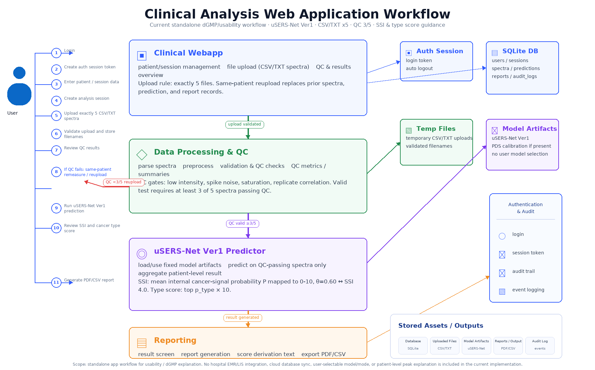

# 현재 Clinical Webapp 분석 워크플로우 정리

## 핵심 범위

이 워크플로우는 현재 사용적합성 및 dGMP 설명용 독립형 웹앱 기준이다. 병원 EMR/LIS 연동이나 클라우드 운영 아키텍처를 전제로 한 그림이 아니라, 스펙트럼 업로드부터 QC, uSERS-Net Ver1 분석, 결과/보고서 생성, 감사 추적까지의 앱 내부 흐름을 설명한다.

## 사용자 흐름

1. 로그인 및 인증 세션 생성
2. 환자 정보 입력: 환자 ID, 나이, 성별, BMI 선택 입력
3. 환자당 CSV/TXT 스펙트럼 파일 5개 업로드
4. QC 결과 확인
5. QC 통과 수가 3개 미만이거나 강도 부족·스파이크 잡음·포화가 하나라도 확인되면 검사 무효로 처리하고 동일 환자 정보 유지 후 재측정/재업로드
6. QC 유효 시 결과 확인: 평균 SSI, 3단계 최종 선별 조치, 암 신호 스펙트럼 참고 수, 필요 시 암종 분류 점수
7. PDF/CSV 보고서 생성

## 현재 구현 기준

| 영역 | 현재 기준 |
| --- | --- |
| 모델명 | `uSERS-Net Ver1` |
| 업로드 | CSV/TXT 파일만 허용, 정확히 5개 필요 |
| 재업로드 | 동일 환자 세션에서 기존 spectra/prediction/report를 새 업로드로 교체 |
| QC 기준 | 5개 중 3개 이상 QC 통과하고 강도 부족·스파이크 잡음·포화가 없어야 검사 유효 |
| QC 항목 | 강도 부족, 스파이크 잡음, 포화, 반복 상관계수 |
| 모델 입력 | 검사 유효 시 QC 통과 스펙트럼만 사용. 치명적 QC 실패가 있으면 추론하지 않음 |
| 평균 SSI | QC 통과 반복측정별 내부 암 관련 신호값의 평균을 0~10으로 변환한 환자 단위 판정 점수 |
| 최종 선별 결과 | 평균 SSI `<1.0`은 기준 미만, `1.0≤SSI≤4.0`은 추가 평가 고려, `SSI>4.0`은 추가 확인 권고 |
| SSI 판정 구간 | LOW [0.0-1.0), MODERATE [1.0-4.0] 포함, HIGH (4.0-10.0]. 각 구간의 관측 암 비율은 각각 1.8%(n=388), 46.0%(n=50), 98.2%(n=1190)이며 개인의 확진 확률을 의미하지 않음 |
| 암종 분류 점수 | 추가 확인 권고일 때만 유효 반복측정의 암종별 상대 분류값을 평균하고 성별 제약 후 재정규화하여 표시하는 0~10 참고 점수 |
| 패턴 구분이 비교적 뚜렷함 | 가장 높은 암종 분석값 50% 이상 또는 2순위보다 20%포인트 이상 높음 |
| 출력 | 결과 화면, PDF 보고서, CSV 다운로드, 감사 로그 |

## 저장소 및 감사 추적

SQLite DB에는 사용자, 세션, 스펙트럼 메타데이터, 예측 결과, 보고서 기록, 감사 로그가 저장된다. 주요 감사 이벤트는 login, create_session, upload, analyze, report_generate, reupload이다.

## 현재 제외 범위

- 병원 EMR/LIS 연동
- 클라우드 DB 동기화
- 사용자 모델 선택 또는 운영 모드 선택 UI
- 환자별 피크 설명 또는 explainability 출력
