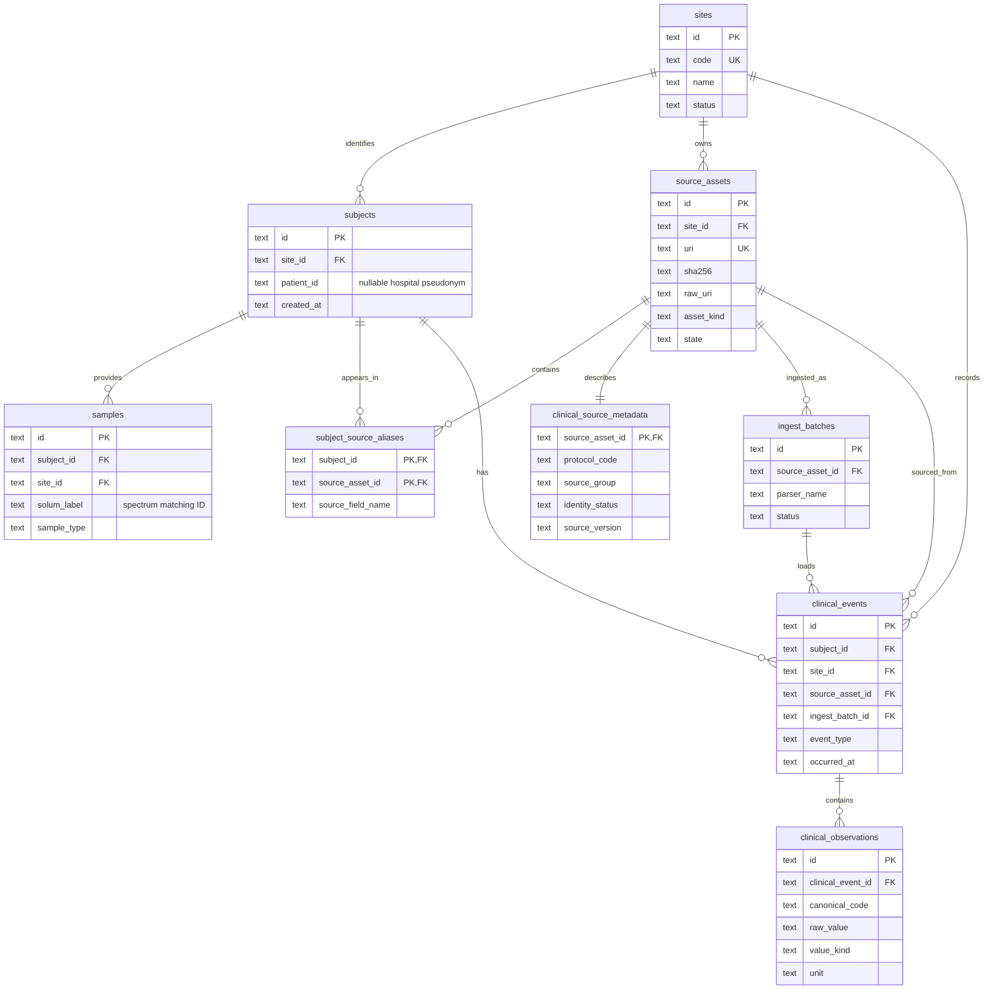
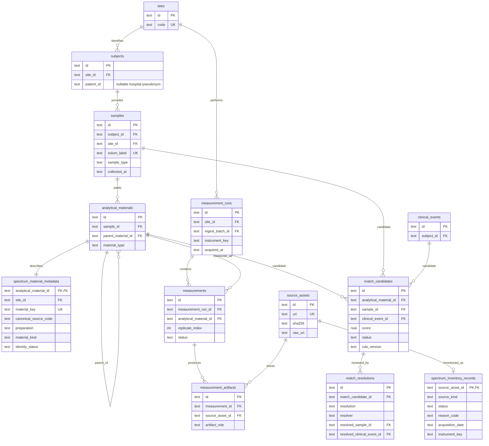
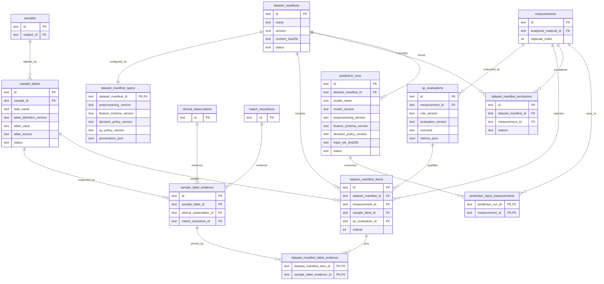

# SERS Master Data ERD

이 문서는 `sers_master.db`를 한 장에 모두 펼치지 않고 세 업무 경계로 나눈다.
같은 테이블이 경계 사이의 연결점일 때는 두 그림에 반복 표시한다.

## 1. 임상정보 ERD

`subjects.patient_id`는 병원이 제공한 가명 환자번호이며 없으면 `NULL`이다.
`solum_label`로 빈 환자번호를 채우지 않는다. `samples.solum_label`은 임상자료와
spectrum 파일을 연결하는 별도 ID다. 원본 위치는 `source_assets.raw_uri`에
보관한다.

## 2. Spectrum 및 임상 매칭 ERD

한 CSV technical replicate는 `measurements` 한 행이며 실제 파일은
`measurement_artifacts`를 통해 `source_assets`에 연결된다. Liquid/Powder는
동일 검체에서 파생된 별도 `analytical_materials`로 표현한다.
Spectrum의 `canonical_source_code`는 같은 site의 `samples.solum_label`과 정확히
일치할 때만 자동 연결한다. `subjects.patient_id`는 spectrum 매칭에 사용하지 않는다.

## 3. QC, Dataset, Prediction MLOps ERD

QC는 `rule_version`과 `evaluation_version`만 사용한다. Dataset과 Prediction은
결과를 덮어쓰지 않고 정확한 label, QC, measurement 조합을 append-only로
추적한다. 운영 앱의 legacy `sessions`/`predictions` 연결 테이블은
`sers_master.db`가 아니라 임상 운영 DB 경계에 둔다.
