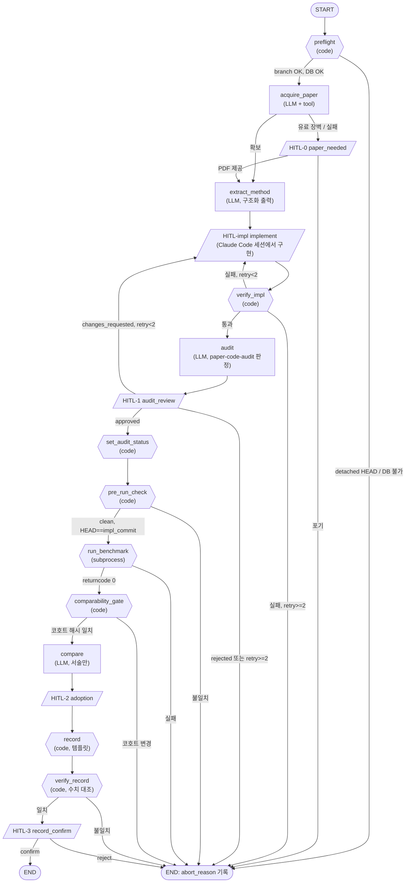

# Preprocessing Lab × LangGraph 파일럿 설계안

- 작성: 2026-09-14 · 상태: **설계 초안 v2 · M0 착수 (2026-09-14). 남은 결정 사항 §13**
- 결정 기록: §13-1 SKILL 관계 = **(b) 파일럿 기간 병행** (사용자, 2026-09-14). §13-5 env·코드 위치 = 제안안대로 M0 착수 (사용자 "M0부터 시작", 2026-09-14)
- 대상: 내부 설계 검토용 (본인)
- 리뷰 반영: `docs/reviews/2026-09-14-plan-executability-reviewer-langgraph-pilot.md`,
  `docs/reviews/2026-09-14-sers-plan-critic-langgraph-pilot.md`
- 관련: `.claude/skills/preprocessing-lab/SKILL.md`, `docs/ml/preprocessing_lab_plugin_guide.md`,
  `scripts/analysis/preprocessing_lab/run_guide_pipeline.py`, `docs/ml/experiment.md` Phase PL

---

## 0. 한 줄 요약

**벤치마크 계산은 기존 스크립트를 subprocess로 호출하고, LangGraph는 "논문 → 구현 → 검수 →
실행 → 비교 → 채택 → 기록" 흐름과 사람 승인 지점만 코드로 강제한다.**

### 범위 수정 (이전 대화의 제안 정정)

이전에 "`Send`로 방법 N개를 병렬 실행하는 게 LangGraph 장점을 가장 잘 보여준다"고 제안했으나
**근거가 틀렸다.** `run_guide_pipeline.py`는 이미 50개 이상 조건, joblib 시드 병렬, 결과 파일
기반 재개, `--dry-run`, 계산/적재 분리(`--load-db`, `--ci-only`), 짝지은 bootstrap Δ를 갖춘
오케스트레이터다. 병렬화 대상이 LLM 호출이 아니라 sklearn CPU 작업이라 `Send`로 옮겨도 이득이
없다. 실제로 **강제되지 않아 사고가 난 부분은 계산이 아니라 흐름**이다 (§1).

---

## 1. 왜 이 범위인가 — 저장소에 남은 실패 증거

| # | 실제로 일어난 일 | 근거 | 그래프에서 막는 곳 |
|---|---|---|---|
| E1 | 사람 검수 게이트 우회 (pending 방법 전부 실행) | `run_guide_pipeline.py:43-46`, `experiment.md:372-373` | HITL-1 승인 외에 `run_benchmark`로 가는 edge 없음 (면제 경로 없음, §6) |
| E2 | 감사 완료 후에도 `audit_status`가 `pending` | `experiment.md:353-354,373`, `db.py`에 갱신 메서드 없음 | 승인 직후 `set_audit_status` 코드 node |
| E3 | PL-2 결과 기록 누락 | `experiment.md:360-362` | `record` → `verify_record` → HITL-3를 거쳐야 END |
| E4 | 미커밋 `config.yaml` 변경 상태로 실험 | `experiment.md:403-405` | `pre_run_check`: 실행 직전 clean + `HEAD == impl_commit` |
| E5 | 실행 중 라벨 1명 변경으로 Δ 부호 반전 | `experiment.md:350-352` | `preflight`에서 measurement_id 집합 해시 저장 → 실행 후 재대조 |
| E6 | 조건 효과와 QC 탈락(환자 수 변화)이 섞임 | `experiment.md:406-407` | `comparability_gate`가 기준 조건 대비 환자 수 감소 행을 비교표에서 분리 |

E1~E6은 모두 **알고 있었지만 기억에 의존하다 빠진 단계**다. 파일럿 성공 기준도 이 6개를 실제로
막는지로 정한다 (§10).

---

## 2. 사람 역할 고정 (기존 규칙을 코드로 옮김)

SKILL.md와 메모리에 이미 고정된 사람 역할을 `interrupt()` 지점으로 1:1 대응시킨다.

| 사람 역할 | 그래프에서 | interrupt |
|---|---|---|
| 레퍼런스 소싱 | 논문 확보 실패 시 PDF/링크 요청 | `HITL-0 paper_needed` |
| 구현 코드 작성 (파일럿 한정) | Claude Code 세션에서 구현 후 commit hash 입력 | `HITL-impl implement` |
| 구현이 논문 핵심 아이디어와 맞는지 검수 | 감사 보고서 확인 → 승인/수정요청/기각 | `HITL-1 audit_review` |
| metrics 비교 검토 + 최종 채택 판단 | 비교표 확인 → 채택/보류/기각 | `HITL-2 adoption` |
| 기록 확정 | 기록 초안 확인 → 반영 + 커밋 | `HITL-3 record_confirm` |

**잘못된 입력 처리 (M0에서 확인한 LangGraph 동작)**: resume 값은 체크포인트에 기록된다.
사람 node가 잘못된 값(예: `"approve"` 오타)에 예외를 던지면, 이후 올바른 값을 넣어도 기록된
잘못된 값이 다시 읽혀 run이 막힌다 (LangGraph 1.2.11). 그래서 잘못된 값은 **통과로도, 예외로도
처리하지 않고** `error` 필드를 붙여 같은 자리에서 다시 묻는다 (`nodes/human.py` `_ask`).

---

## 3. 그래프 구조



범례: `{{ }}` 코드 node (LLM 없음) · `[ ]` LLM node · `[/ /]` 사람 승인 (`interrupt()`)

**LLM이 들어가는 node는 4개(acquire_paper·extract_method·audit·compare)뿐이다.** 수치를 다루는
node(`run_benchmark`, `comparability_gate`, `record`, `verify_record`)는 모두 코드다.

---

## 4. State 스키마

```python
from typing import Literal, TypedDict

class CohortSnapshot(TypedDict):
    cohort_groups: list[str]
    counts_by_group: dict[str, int]
    measurement_ids_sha256: str          # E5: 개수가 같아도 구성이 바뀌면 잡힘
    label_map_sha256: str                # measurement_id → cohort_group 매핑 해시 (라벨 맞교환 대비)
    sites: list[str]                     # 병원 구성 (confound 표시용)
    instruments: list[str]
    taken_at: str

class AuditVerdict(TypedDict):
    matches_core_idea: bool
    mismatches: list[dict]               # {"item", "paper", "code", "severity"}
    unverifiable: list[str]
    source_used: Literal["paper_fulltext", "author_code", "design_guide_summary"]

class LabState(TypedDict):
    run_key: str                         # f"{method_key}:{YYYYMMDD-HHMM}" = thread_id
    method_key: str                      # dispatcher 문자열
    stage: str
    paper: dict | None
    extracted: dict | None
    impl_commit: str | None
    condition_name: str | None           # run_guide_pipeline.CONDITIONS 키
    verify_report: dict | None
    implement_attempts: int              # HITL-impl 진입 횟수 (최초 1 + 재시도 2 = 한도 3)
    audit: AuditVerdict | None
    human_audit: dict | None             # {"decision", "note", "at"}
    preflight: dict | None               # git_branch, pghost, cohort_snapshot
    pre_run: dict | None                 # head, dirty, matches_impl_commit
    benchmark: dict | None               # run_name, out_dir, summary_csv, returncode, log_path
    comparability: dict | None           # 코호트 재대조 결과, 분리된 조건 목록과 사유
    comparison: dict | None              # DB 조회 결과(수치) + LLM 관찰(서술)
    adoption: dict | None                # {"decision": adopt|hold|reject, "note"}
    record_draft: dict | None            # 대상별 초안 (§5.4)
    record_check: dict | None
    abort_reason: str | None
```

원칙: **스펙트럼·환자 단위 데이터는 state에 넣지 않는다.** 경로, run_name, 집계 지표만 둔다.

---

## 5. Node 명세

| node | 종류 | 하는 일 | 재사용 자산 | 실패 처리 |
|---|---|---|---|---|
| `preflight` | 코드 | 브랜치 확인(detached HEAD 거부), DB 접속, 코호트 스냅샷(§4) 저장 | `scripts/db/pghost.sh`, `aecd-data-ops` 절차 | ABORT |
| `acquire_paper` | LLM+도구 | 전문·저자 공개 코드 확보 | `alpha-research` 절차, `docs/ml/papers/` | 유료 장벽 → HITL-0. **우회 다운로드 금지** |
| `extract_method` | LLM | 알고리즘·파라미터·기본값 구조화 추출 | `preprocessing_design_guide.md` | 스키마 검증 실패 시 1회 재시도 |
| `HITL-impl` | 사람 | 플러그인 가이드 1~5단계 + `CONDITIONS` 조건 추가 후 커밋, hash 입력 | `preprocessing_lab_plugin_guide.md` | — |
| `verify_impl` | 코드 | pytest·ruff, dispatcher 등록, **`CONDITIONS`에 조건 존재**, 기본 config 회귀(프로덕션 불변) | 기존 테스트 | retry<2 → HITL-impl |
| `audit` | LLM | 논문/저자 코드 vs diff 대조 → `AuditVerdict` | `paper-code-audit` 스킬 | 요약본 근거면 `source_used`에 명시 |
| `set_audit_status` | 코드 | `audit_status`만 UPDATE | **신규 메서드** (§9). `upsert_method`는 이 컬럼을 건드리지 않아 경로 충돌 없음 | 실패 시 ABORT |
| `pre_run_check` | 코드 | 작업 트리 clean, `HEAD == impl_commit` | — | ABORT (E4) |
| `run_benchmark` | subprocess | `--dry-run` → 본 실행 → `--load-db`, 모두 `--conditions <condition_name>` | `run_guide_pipeline.py` (§5.1) | returncode≠0 → ABORT |
| `comparability_gate` | 코드 | 코호트 해시 재대조, 기준 조건 대비 환자 수·QC 통과 수, 병원·장비 구성, `check_comparable()` | `sers.evaluation.schema.check_comparable` | 해시 불일치 → ABORT. 환자 수 감소 → 비교표에서 분리 (§5.3) |
| `compare` | LLM | **수치는 코드가 DB에서 만든 표를 그대로 사용**, LLM은 관찰 서술만. 채택 표현 금지 | `sers-preprocessing-comparator.md` 본문 | — |
| `record` | 코드 | 템플릿으로 기록 초안 생성 (§5.4) | `experiment-runner` 절차 | — |
| `verify_record` | 코드 | 초안의 모든 수치를 DB·`summary.csv`와 대조 | `sers-experiment-auditor` 기준 | 불일치 → ABORT |
| `HITL-3` | 사람 | 초안 확인 → 반영 → **즉시 커밋** | CLAUDE.md 커밋 규칙 | — |

### 5.1 기존 스크립트 재사용 전제 — 최소 수정 필요

`run_guide_pipeline.py`는 계산 로직은 그대로 쓸 수 있으나, 기록용 값이 PL-3에 고정돼 있다.

| 고정값 | 위치 | 그대로 쓰면 |
|---|---|---|
| `DATE_TAG = "20260907"` | `:125` | 새 실행이 PL-3 산출물 경로에 섞이고, 결과 파일이 있으면 건너뜀 (`:549-552`) |
| `notes = "...audit gate 면제...채택 근거 아님"` | `:794-796` | **승인된 방법도 "면제된 탐색 실험"으로 DB에 적재됨** |
| `phase="PL-3"`, `baseline="cal_despike"` | `:805-806` | phase·기준 조건이 틀리게 기록됨 |
| `CONDITIONS` 하드코딩 | `:142~` | 새 방법은 조건 항목 추가 필요 |

제안: 계산 로직은 건드리지 않고 **`--date-tag`, `--phase`, `--notes`, `--baseline-ref` 인자만 추가**한다.
기본값은 현재 고정값과 같게 둬서 PL-3 재현성을 유지한다. (§13 결정 2)

### 5.2 E6 기준 조건과 임계값

- 기준 조건: `cal_ps_si` — 스크립트 주석상 2026-09-09 사용자 결정 이후 기준 (`run_guide_pipeline.py:286`).
- 분리 규칙: 기준 조건 대비 환자 수가 줄어든 조건은 **비교표 본표에서 빼고 "비교 불가(QC 탈락으로
  환자 구성 변경)" 섹션으로 이동**한다. 경고만 하고 채택 판단까지 섞여 들어가지 않게 한다.
- 임계값(몇 명 감소부터 분리할지)은 도메인 판단이라 **미정** (§13 결정 4). 파일럿 테스트에서는
  PL-3 `bl_arpls_1e3`(환자 84명, `experiment.md:386`)이 분리되는지로 확인한다.
- `check_comparable()`은 cohort_id만 비교하므로(`schema.py:169`) 이 규칙을 대신하지 못한다.

### 5.3 병원 confound 표시

`comparability_gate`는 스냅샷의 `sites`·`instruments`를 `compare` 입력에 넘기고, 현재 코호트가
**단일 병원(보라매)**이라는 한계를 비교표 머리에 고정 문구로 붙인다.

### 5.4 기록 대상 (CLAUDE.md 실험 히스토리 규칙)

`record`는 아래 모든 곳의 초안을 만든다. 모든 수치는 코드가 DB·`summary.csv`에서 채운다.

1. `docs/ml/experiment.md` — append 초안 (기존 기록 수정 금지)
2. `logs/experiment_registry.json` — 추가 항목
3. `workspace/solum-dashboard/SERS_AI_Experiment_History.html` — `PHASES` 항목 초안
4. `~/.claude/projects/-home-user-SERS-AI/memory/` 해당 파일 갱신 초안

HITL-3 이후 반영하고 커밋한다. **`sync_dashboard.py`·`sync_data.py`(Supabase)는 실행하지 않는다.**

---

## 6. 조건부 edge와 반복 한도

| 분기 | 조건 | 한도 |
|---|---|---|
| `preflight` → ABORT | detached HEAD, DB 접속 실패 | — |
| `verify_impl` → `HITL-impl` | 테스트·ruff·조건 등록 실패 | `implement_attempts < 3` (= retry < 2) |
| `HITL-1` → `HITL-impl` | `changes_requested` | 같은 카운터 |
| `HITL-1` → `run_benchmark` 우회 | **없음. 면제 경로를 두지 않는다.** pending 방법의 탐색 실행이 필요하면 그래프 밖에서 기존 스크립트로 직접 한다 (SKILL.md 금지사항과 일치). | — |
| `pre_run_check` → ABORT | dirty 또는 `HEAD != impl_commit` | — |
| `comparability_gate` → ABORT | 코호트 해시 불일치 | — |
| `verify_record` → ABORT | 초안 수치 ≠ DB/CSV | — |

---

## 7. 체크포인트·보안

- `SqliteSaver` (로컬). `thread_id = run_key`(`method_key:시각`)라 같은 방법을 다시 실행해도 이력이 겹치지 않는다.
- 위치: git-ignored 경로 (예: `results/preprocessing_lab/langgraph/checkpoints.sqlite`). 최종 SSOT는 DB와
  experiment.md이고, checkpoint는 재개·추적용이다.
- **Supabase 사용 금지 (회사 보안정책, 무조건).** LangSmith·Studio는 보안정책 확인 전 사용 안 함.
- 실행 환경에 `LANGSMITH_TRACING=false`를 명시한다.
- DB 연결: 가능하면 `experiment` 스키마에만 쓰기 권한이 있는 전용 role을 쓴다. 임상 원본 스키마 읽기 전용을
  선언이 아니라 권한으로 보장한다 (§13 결정 6).
- LLM API로 보내는 데이터: 논문 텍스트, 코드 diff, 집계 지표. **M2는 보안정책 확인 완료 전 착수하지 않는다.**

---

## 8. 시각화 (로컬 전용)

| 방법 | 네트워크 | 권장 |
|---|---|---|
| `graph.get_graph().draw_mermaid()` → mermaid 텍스트 | 없음 | **기본** |
| 위 텍스트 → `mmdc -i graph.mmd -o graph.svg` (`~/.nvm/versions/node/v20.20.2/bin/mmdc` 설치 확인) | 없음 | 이미지 필요 시 |
| 텍스트를 `.md` mermaid 블록에 붙여 VS Code/Obsidian 미리보기 | 없음 | 문서화용 |
| `draw_mermaid_png()` | 기본 렌더러가 외부 서비스일 수 있음 | 설치 후 인자 확인 전 사용 안 함 |
| `draw_png()` (graphviz) | 없음 | `dot` 미설치 → 제외 |
| LangGraph Studio (`langgraph dev`) | LangSmith 계정·키 필요, UI는 호스팅 페이지 | 보안정책 확인 전 보류 |

- 서브그래프까지 펼치기: `get_graph(xray=True)`
- 구현 후 `draw_mermaid()` 출력과 §3을 대조해 설계와 실제 그래프가 일치하는지 확인한다.

---

## 9. 파일 구조

M0 현재 (2026-09-14):

```
src/sers/preprocessing_lab/graph/
├── __init__.py         # build_graph, LANGSMITH_TRACING=false 강제
├── state.py            # LabState, AuditVerdict, CohortSnapshot, 허용값 집합
├── routing.py          # 분기 규칙 + abort_reason (통과는 값이 정확히 True일 때만)
├── builder.py          # StateGraph 조립, overrides로 node 교체
├── cli.py              # show / start / status / resume
└── nodes/
    ├── human.py        # HITL 5개 — 실제 동작 (interrupt + 재질문)
    └── stubs.py        # 코드·LLM node 12개 자리표시자
tests/preprocessing_lab/graph/test_graph_skeleton.py
```

M1/M2에서 `stubs.py`의 함수를 아래 모듈로 옮기며 교체한다:
`preflight.py`(preflight, pre_run_check) · `paper.py`(acquire_paper, extract_method) ·
`implement.py`(verify_impl) · `audit.py`(audit, set_audit_status) ·
`benchmark.py`(run_benchmark, comparability_gate) · `report.py`(compare, record, verify_record) ·
`prompts/`(기존 agent .md를 경로로 로드, 복사하지 않음).

실행 (env `sers-langgraph` = Python 3.12, langgraph 1.2.11, langgraph-checkpoint-sqlite 3.1.1,
`pip install -e .` 기본 의존성):

```bash
python -m sers.preprocessing_lab.graph.cli show
python -m sers.preprocessing_lab.graph.cli start --method-key <key>
python -m sers.preprocessing_lab.graph.cli resume --run-key <run_key> --payload '<json>'
pytest tests/preprocessing_lab/graph
```

`sers-analysis`·base env에는 langgraph가 없어 이 테스트는 skip된다 (`importorskip`).

추가 수정: `db.py`에 `set_audit_status(method_key, status, note)`, `run_guide_pipeline.py`에 인자 4개 (§5.1).

---

## 10. 검증 (파일럿 성공 기준)

| 검증 | 입력 | 기대 결과 |
|---|---|---|
| E1 | pending 방법, HITL-1에 approved 이외 입력 | `run_benchmark` 도달 불가. 그래프에 우회 edge가 없음을 `get_graph()` edge 목록으로도 확인 |
| E2 | HITL-1 approved | DB `audit_status = 'approved'` |
| E3 | (a) HITL-3 대기 중 프로세스 종료 (b) HITL-3에서 reject | (a) run이 대기 상태로 남고 재개 시 기록 확인부터 이어짐 (b) ABORT로 종료되며 `abort_reason`에 반려 기록 — 어느 경우도 "기록 완료"로 끝나지 않음 |
| E4 | `HITL-impl` 이후 미커밋 변경 추가 / 다른 커밋으로 이동 | `pre_run_check` ABORT |
| E5 | preflight 이후 measurement_id 집합·라벨 매핑을 바꾼 스냅샷 주입 (모킹) | `comparability_gate` ABORT |
| E6 | PL-3 `bl_arpls_1e3` 결과 | 본표에서 분리되어 "비교 불가" 섹션에 표시 |
| audit 정확도 | Whitaker–Hayes 초기 구현 커밋 `b9483f0` (threshold 7.0 여부 착수 시 확인) | 기존 감사가 찾은 불일치 2건(threshold 7.0→6.0, force_endpoints) 탐지 |
| compare·record 무결성 | PL-3 결과 | 모든 수치가 DB 조회값과 일치, 채택 표현 없음 |

LLM node는 프롬프트를 바꿀 때마다 위 사례를 다시 돌려 회귀를 확인한다.

---

## 11. 마일스톤

| 단계 | 내용 | API 키 |
|---|---|---|
| **M0** ✅ 2026-09-14 | 새 conda env, stub node로 그래프 골격, interrupt·checkpoint 재개, `draw_mermaid()`와 §3 대조. 테스트 18개 통과 (행복 경로·E1 구조·비승인 차단·재시도 한도·코드 검사 실패 4종·오타 재질문·SQLite 재개), ruff 통과, CLI 프로세스 재시작 재개 확인 | 불필요 |
| **M1** | 코드 node 전부 (preflight, verify_impl, set_audit_status, pre_run_check, run_benchmark `--dry-run`, comparability_gate, record, verify_record) + E1~E6 테스트 | 불필요 |
| **M2** | LLM node 4개 구조화 출력 + audit 정확도 평가. **보안정책 확인 후 착수** | 필요 |
| **M3** | 구현 갭 방법 1개로 전 과정 실행 | 필요 |

M0·M1만으로 E1~E6 전부를 코드 수준에서 막을 수 있다. LLM 없이 얻는 이득이 먼저 온다.

---

## 12. 하지 않는 것

- `run_guide_pipeline.py`의 계산 로직 재작성 (기록용 인자 추가만, §5.1)
- `Send`로 조건·시드 병렬화 (이미 joblib)
- LLM이 채택 결정하거나 수치를 생성하는 것
- 임상 원본 스키마(`master`/`clinical`/`measurement`) 쓰기
- Supabase 사용 (무조건 금지), LangSmith·Studio 사용 (보안정책 확인 전)
- 유료 논문 우회 다운로드
- 검수 게이트 면제 경로

---

## 13. 착수 전 사용자 결정 필요

1. **SKILL과의 관계** — SKILL.md는 "워크플로우 전용 로직을 새로 만들지 않는다"(`:15-19`), "평가는 항상
   `@model-bench`"(`:63`)라고 한다. 이 그래프는 SKILL 순서를 코드로 옮기고, 평가는 PL-1 규약이 들어 있는
   기존 스크립트를 쓴다(PL-1·PL-3도 실제로 이 스크립트로 실행됨). 선택지:
   (a) 그래프를 SKILL의 실행 형태로 정하고 SKILL.md에 그래프 경로와 평가 경로를 반영
   (b) 파일럿 기간은 SKILL과 병행, 결과를 보고 결정
2. **스크립트 최소 수정** — §5.1의 인자 4개 추가 방식에 동의하는지
3. **API 키·보안정책** — Anthropic API 키 없음. 논문 텍스트·diff·집계 지표 전송 가능 여부 확인
4. **E6 임계값** — 기준 조건 `cal_ps_si` 대비 환자 수가 몇 명(또는 몇 %) 줄면 비교에서 분리할지
5. **실행 환경·위치** — 새 conda env(`sers-langgraph`, Python 3.12), 코드 `src/sers/preprocessing_lab/graph/`,
   checkpoint 경로 (§7)
6. **DB 권한** — `experiment` 스키마 전용 쓰기 role 생성 여부 (DB 권한 변경이라 별도 승인 필요)
7. **M3 대상 방법** — 구현 갭(despike Ryabchykov / denoise Barton·Wiener·CDAE / baseline ModPoly
   Lieber·Zhao) 중 1개. 저자 공개 코드가 있는 방법이 audit 검증에 유리.
   참고: Zhao 인용은 출처검증에서 주장과 반대로 확인됨 (`docs/reviews/2026-09-02-design-guide-source-verification.md`)
