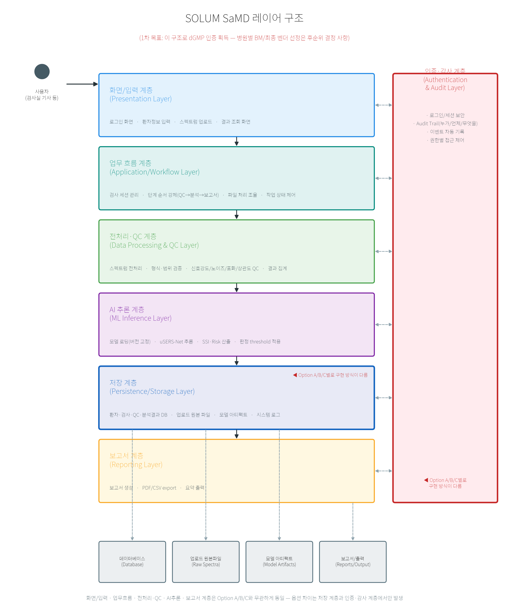
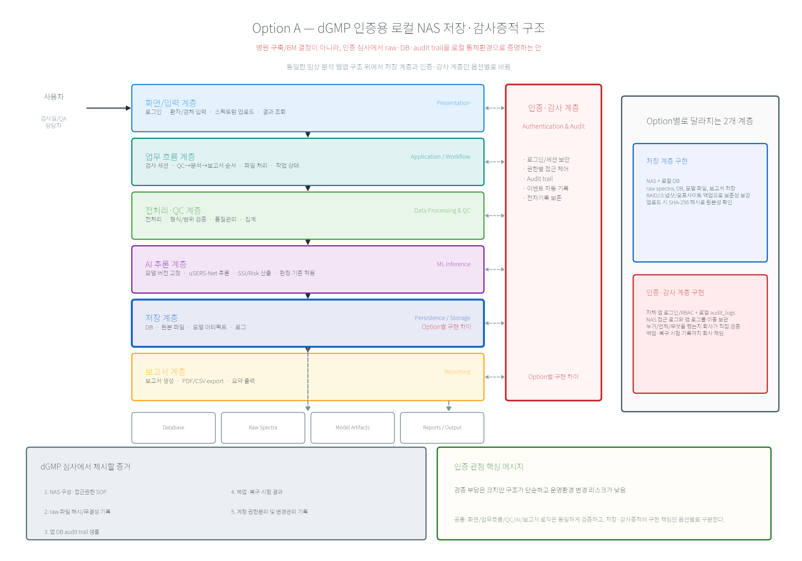
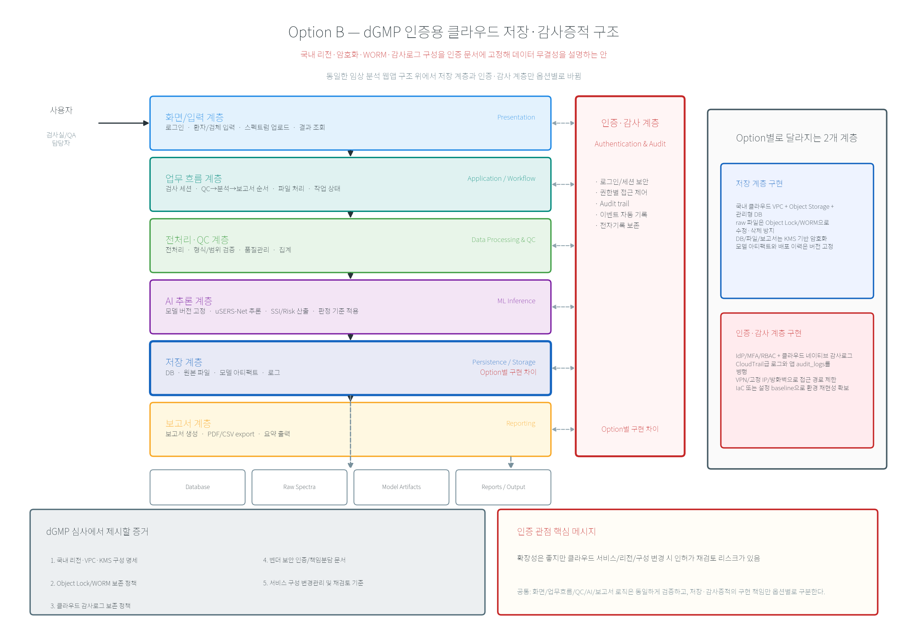
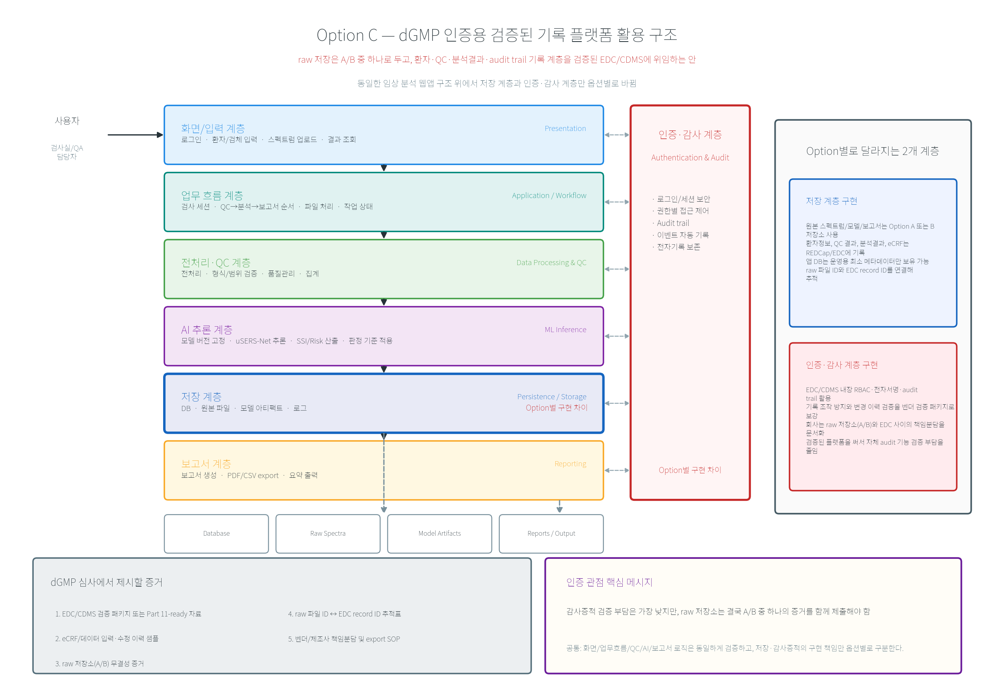

# SaMD 인프라/보안 아키텍처 옵션 비교 — Option A(NAS) / B(Cloud) / C(검증된 플랫폼 활용)

- 상태: 검토용 비교 자료 (최종 채택 결정은 인허가/QA/경영진 확인 필요)
- 관련 문서: [[samd_db_scope]] (docs/samd_db_scope.md) — 개발 8단계와 DB 스키마 정의
- 근거: MFDS 디지털의료기기 GMP는 ISO 13485 기반이며 8개 유형군(AI/ML 포함 특성 반영)으로 구분되고, "소프트웨어 기능의 작동과 입력 적합성, 출력 정확성, 자료파일과 같은 외부 정보의 무결성"을 입증해야 한다. 클라우드 사용 시 IaaS/PaaS/SaaS 형태 변경이나 클라우드 서버 운영환경 변경은 **변경허가 대상**이다. 개인정보보호법상 의료정보는 "민감정보"로 별도 보호 대상이다. (Sources 참조)

> **범위 — 반드시 먼저 읽을 것**: 이 문서의 목표는 **dGMP 인증을 획득하는 데 필요한 구조를 정리하는 것**까지다. 어느 병원에 어떤 방식(자체 판매/임대/SaaS 등)으로 공급할지 같은 **병원별 BM(비즈니스 모델)은 이 문서의 범위 밖이며 후순위로 결정한다.** 그래서 아래 Option A/B/C는 "병원 영업 방식"이 아니라 "인증 심사에서 데이터 무결성·감사증적을 어떻게 증명할 것인가"에 대한 답이다.
>
> **주의**: 아래 비용은 모두 추정치이며, 실제 벤더 견적/식약처 가이드라인 원문 확인 전까지는 잠정 수치로 취급할 것. dGMP 적합성 판단은 최종적으로 인허가 컨설턴트/QA 검토가 필요하다.

---

## 아키텍처 레이어 관점에서 보기



우리 소프트웨어를 6개 계층(화면/입력 → 업무흐름 → 전처리·QC → AI추론 → 저장 → 보고서) + 옆에 붙는 인증·감사 계층으로 나눠보면, **Option A/B/C의 차이는 딱 2개 계층에서만 발생한다**:

1. **저장 계층 (Persistence/Storage Layer)** — 환자·검사·QC·분석결과 DB, 업로드 원본 파일, 모델 아티팩트, 로그를 "어디에" 두는가
2. **인증·감사 계층 (Authentication & Audit Layer)** — "누가 언제 무엇을 했는지"를 "어떤 방법으로" 증명 가능하게 기록하는가

나머지 4개 계층(화면/입력, 업무흐름, 전처리·QC, AI추론, 보고서)은 **Option과 무관하게 완전히 동일한 소프트웨어**다 — 이 부분은 이미 만들어져 있고([[project_ssi_risk_threshold_policy]] 등), Option 선택으로 다시 개발할 필요가 없다. 즉 이번 의사결정은 "소프트웨어를 어떻게 만들까"가 아니라 "이미 정해진 소프트웨어의 저장소·기록계층을 어디에 둘까"로 범위가 좁다.

| 계층 | Option 영향 | 비고 |
|---|---|---|
| 화면/입력 | 없음 | 동일 소프트웨어 |
| 업무흐름 | 없음 | 동일 소프트웨어 |
| 전처리·QC | 없음 | 동일 소프트웨어 |
| AI 추론 | 없음 | 동일 소프트웨어 |
| **저장 계층** | **있음** | 아래 1~3장에서 Option별로 상세 설명 |
| 보고서 | 없음 | 동일 소프트웨어(저장 위치만 저장 계층을 따라감) |
| **인증·감사 계층** | **있음** | 아래 1~3장, 특히 Option C(3.2)에서 상세 설명 |

---

## 전문용어 쉬운 설명 (먼저 읽으면 아래 내용이 편해짐)

| 용어 | 쉬운 설명 |
|---|---|
| SMB/NFS | 컴퓨터끼리 파일을 주고받을 때 쓰는 통신 규칙(파일 공유 방식) |
| RAID | 하드디스크 여러 개에 같은 내용을 나눠·겹쳐 저장해서, 하나가 고장 나도 데이터를 잃지 않게 하는 기술 |
| VPN | 공용 인터넷 안에 우리만 쓰는 비밀 통로를 만들어주는 기술 |
| 방화벽 | 허락한 통신만 지나가게 하고 나머지는 막는 보안 장치 |
| 해시(SHA-256) | 파일 내용을 지문처럼 요약한 고유값. 파일이 한 글자라도 바뀌면 이 값도 달라져서, 원본이 훼손됐는지 바로 확인 가능 |
| IdP / SSO | 회사 계정 하나로 여러 시스템에 로그인할 수 있게 해주는 방식 |
| MFA | 비밀번호 외에 휴대폰 인증 등 한 단계를 더 거치게 하는 2차 보안 |
| VPC | 클라우드 안에 우리 회사만 쓰는, 다른 회사와 격리된 가상의 사설 네트워크 |
| KMS | 암호화에 쓰는 열쇠(키)를 앱과 분리해서 별도로 안전하게 보관·관리해주는 서비스 |
| Object Storage | 파일을 통째로 저장하는 창고형 클라우드 저장공간 |
| Object Lock / WORM | 한번 저장한 파일을 정해진 기간 동안 아무도 수정·삭제하지 못하게 잠그는 기능 |
| TLS | 인터넷으로 데이터를 주고받는 구간을 암호화해서, 중간에서 누가 엿봐도 못 읽게 하는 기술 |
| AES-256 | 저장된 데이터 자체를 암호화하는 방식(현재 널리 쓰이는 강력한 표준) |
| Presigned URL | 정해진 시간 동안만 유효한 1회용 업로드/다운로드 링크 |
| CloudTrail(급) 서비스 | 클라우드에서 누가 언제 무엇을 했는지 자동으로 남기는 기록 서비스 — 사람이 지울 수 없음 |
| ISO 27001 / ISMS-P | 정보보안을 제대로 관리하고 있는지 외부 기관이 심사해서 주는 인증 |
| ALCOA+ | 데이터가 믿을 만한지 점검하는 국제 기준 8가지 (누가 만들었는지, 원본이 맞는지, 훼손 없이 보존됐는지 등) |
| FHIR | 의료 데이터를 병원·시스템 간에 같은 형식으로 주고받기 위한 국제 표준 규격 |
| MedTech Service / IoT Connector | 의료기기에서 나오는 측정 데이터를 자동으로 받아 표준 형식으로 정리해주는 클라우드 서비스 |
| EDC / CDMS | 임상시험에서 환자 데이터를 입력·관리하는 전용 소프트웨어 — 이미 규제기관 기준을 통과해 검증되어 있음 |
| eCRF | 종이 증례기록지 대신 화면으로 입력하는 전자 증례기록지 |
| RBAC | 직급/역할에 따라 볼 수 있는 화면과 할 수 있는 작업을 다르게 설정하는 방식 |
| CSAP | 국내 클라우드 서비스가 보안 기준을 충족하는지 정부기관(KISA)이 심사해서 주는 인증 |
| IaC (Infrastructure as Code) | 서버·보안 설정을 손으로 하나씩 하지 않고, 코드로 작성해 자동으로 항상 같은 방식으로 구성하는 방법 |
| Shared Responsibility Model (책임분담 모델) | 클라우드/외부 시스템을 쓸 때 "여기까지는 벤더 책임, 여기부터는 우리 책임"이라고 미리 문서로 나눠두는 것 |
| 21 CFR Part 11 | 미국 FDA가 정한, 전자기록·전자서명이 신뢰할 수 있으려면 갖춰야 할 요건(자동 기록/추적 포함) |
| dGMP | 국내 식약처가 정한 디지털의료기기 제조 및 품질관리 기준 |

---

## 0. 세 옵션 한눈에 보기

> Option C는 애초 "USB/외장HDD"로 잡았으나, 실제로 다른 의료기기/IVD 회사들이 무엇을 쓰는지 조사한 결과 그런 회사는 없었다 (아래 3장 근거). 실무에서 쓰이는 3번째 패턴은 **"직접 구축(Build)하지 않고 이미 검증된 컴플라이언스 플랫폼을 가져다 쓰는(Buy)" 방식**이라, Option C를 이렇게 재정의했다.

| | Option A: NAS 로컬(Build) | Option B: Cloud 자체구축(Build) | Option C: 검증된 플랫폼 활용(Buy) |
|---|---|---|---|
| 아키텍처 | Raman PC → 로컬망 NAS → 분석 PC | Raman PC → (VPN/전용회선) → Cloud 저장소/서버 → 웹앱 | Raman PC → NAS/Cloud(raw 저장, A·B와 동일) + **REDCap/EDC**(환자·QC·분석결과·Audit Trail 기록, 이미 21 CFR Part 11 검증됨) |
| 초기 구축 비용(추정) | **~150만원** (NAS 장비 + RAID + 초기 설정, 사용자 제시값) | 300~800만원 (네트워크/암호화/계정/감사로그 설계+구축) | raw 저장은 A와 동일(~150만원) + EDC 라이선스 **0원~수백만원**(REDCap: 대학병원 컨소시엄 소속이면 무료 / 상용 EDC: 유료, 견적 별도) |
| 월 운영비(추정) | 낮음 (전기/유지보수) | 30~150만원 (인스턴스+스토리지+백업+트래픽, 규모에 따라 변동) | raw 저장 운영비(A/B와 동일) + EDC 자체 운영비는 거의 없음(호스팅형이면 벤더 부담) |
| 인허가 변경허가 영향 | 없음 (온프레미스, 운영환경 변경 없음) | **있음** — 클라우드 서비스 형태/운영환경 변경 시 변경허가 필요 | 낮음 — EDC는 SW 자체의 운영환경이 아니라 임상 데이터 관리 도구로, raw 저장 구조(A 또는 B)에 종속 |
| dGMP Data Integrity/Audit Trail 충족 가능성 | 가능 (직접 구성 필요, 검증 부담 회사가 짐) | 가능 (네이티브 서비스 활용 시 상대적으로 용이) | **가장 용이** — audit trail/전자서명/접근통제가 이미 벤더 단에서 검증·구현되어 있음 |
| 개인정보 국내 보관 | 자동 충족 | 국내 리전 선택 시 충족 (계약상 검토 필요) | EDC 벤더의 호스팅 위치 확인 필요(REDCap은 자체 서버에 설치하는 방식도 가능 — 국내 기관/자체 서버에 설치 시 국내 보관 충족) |
| 재해복구/백업 | 별도 구성 필요(2차 백업 권장) | 서비스 내장 기능 활용 가능 | EDC 자체는 벤더/기관이 백업 관리, raw 파일은 A/B 정책 따름 |
| 다기관/원격 접근 확장성 | 낮음 (VPN 필요) | 높음 | 높음 — REDCap/상용 EDC 모두 다기관 임상연구용으로 설계됨 |
| 권장 여부 | **1차 권장** (dGMP 준비/사용적합성 시험 자료 정리 단계에 적합) | 다기관 확장 시 재검토 | **A/B와 병행 검토 권장** — raw 파일 저장(A 또는 B)은 그대로 두고, 환자정보·QC·분석결과·Audit Trail 계층만 REDCap 등으로 대체하면 자체 개발/검증 부담이 크게 줄어듦 |

---

## 1. Option A — NAS 기반 로컬 인증 구조



**쉬운 설명**: 이 옵션은 "어느 병원에 지금 설치한다"는 뜻이 아니라, dGMP 심사에서 원본 파일·DB·audit trail을 **로컬 통제환경(NAS + 로컬 DB)**으로 관리하겠다고 설명하는 안이다. 앱의 화면/업무흐름/QC/AI/보고서 로직은 그대로 두고, 저장 계층과 인증·감사 계층만 회사가 직접 구성·검증한다. 구조는 단순하지만, NAS 접근권한, 파일 해시, 백업·복구 시험, 앱 audit log를 모두 회사가 증거로 만들어야 한다.

<details>
<summary>기술 상세 (아키텍처 다이어그램 텍스트)</summary>

```
[Raman 장비/벤더 SW] → CSV/TXT
        ↓ (로컬 통제망, 유선)
[측정 PC]
        ↓ (SMB/NFS, 접근계정 분리)
[NAS] ── RAID 1/5 미러링, 스냅샷
        ↓
[분석 PC (SaMD 소프트웨어)]
        ↓
[DB (로컬 PostgreSQL/SQLite)]
```

</details>

### 필요한 보안 조치
- NAS 계정 분리: raw 데이터 쓰기 권한(장비 PC만) vs 읽기 권한(분석 PC) 분리 — [[samd_db_scope]]의 "Raw Data 접근 권한과 알고리즘 분석 수치 접근 권한 분리" 요구사항과 직결
- RAID 미러링 + 정기 스냅샷(일 단위) — 단일 장애점 방지
- NAS 자체 접근 로그(누가 언제 어떤 파일에 접근했는지) → `audit_logs`의 `FILE_UPLOAD`/`FILE_HASH_CREATED` 이벤트 소스로 연동
- 폐쇄망 또는 방화벽으로 외부 인터넷 접근 차단 (로컬 통제망 격리)
- 파일 무결성: 업로드 시점 SHA-256 해시 생성·저장 (`spectrum_files.file_hash_sha256`) — NAS 자체 변조 여부와 무관하게 DB가 진실 원천

### 개발 8단계별 필요 사항 (Option A 기준)

| 단계 | Option A에서 추가로 필요한 것 |
|---|---|
| 1) 로그인/권한 | 로컬 인증 서버 또는 분석 PC 로컬 계정 DB — 외부 IdP 불필요 |
| 2) 환자 등록 | 특이사항 없음 (로컬 DB) |
| 3) 스펙트럼 업로드 | NAS 마운트 경로 고정, 업로드 시 SMB 쓰기 권한 검증 로직 |
| 4) QC | 특이사항 없음 |
| 5) AI 분석 | 모델 아티팩트도 NAS 또는 분석 PC 로컬에 버전관리 — 원격 모델 레지스트리 불필요 |
| 6) 결과 해석 | 특이사항 없음 |
| 7) 보고서 생성 | PDF는 NAS 별도 폴더에 보관 (raw와 분리) |
| 8) Audit Trail | NAS 접근 로그 + 앱 DB `audit_logs` 이원화, 주기적으로 교차검증(파일 수 일치 확인) 권장 |

### 리스크
- NAS 장애/화재 등 물리적 단일 지점 장애 → **오프사이트 백업(클라우드 또는 별도 위치 NAS) 1개는 병행 권장** (Option A만으로는 재해복구 취약)
- 로컬 통제망이라도 USB/외장매체를 통한 우회 반출 통제(엔드포인트 정책)는 별도 필요

---

## 2. Option B — Cloud 기반 인증 구조



**쉬운 설명**: 이 옵션은 dGMP 심사에서 원본 파일·DB·audit trail을 **국내 클라우드 통제환경**으로 관리하겠다고 설명하는 안이다. 앱 로직은 동일하고, 저장 계층은 국내 리전의 Object Storage/관리형 DB/KMS로 구성하며, 인증·감사 계층은 IdP/MFA/RBAC와 클라우드 감사로그로 보강한다. 확장성은 좋지만, 클라우드 서비스·리전·구성이 바뀌면 인허가 재검토 또는 변경관리 이슈가 생길 수 있으므로 처음부터 문서에 구성을 고정해야 한다.

<details>
<summary>기술 상세 (아키텍처 다이어그램 텍스트)</summary>

```
[Raman 장비/벤더 SW] → CSV/TXT
        ↓
[측정 PC] → (TLS, VPN 또는 전용회선)
        ↓
[Cloud VPC — 국내 리전]
   ├─ Object Storage (버전관리 + WORM/Object Lock)  ← raw 파일
   ├─ 관리형 DB (RDS 등, 암호화 at-rest)             ← 메타데이터/분석결과
   ├─ KMS (암호화 키 관리)
   └─ 감사로그 서비스 (CloudTrail급) → audit_logs 소스
        ↓
[웹앱 (분석/보고서, HTTPS)]
```

</details>

### 필요한 보안 조치
- **국내 리전 선택 필수** (개인정보보호법상 의료정보는 민감정보 — 국외 이전 이슈 회피). Naver Cloud/KT Cloud/NHN Cloud 등 국내 사업자 또는 AWS/Azure 서울 리전 검토
- ISO 27001 / ISMS-P 인증 보유 사업자 우선 검토 (검색 결과 근거)
- Object Storage에 **Object Lock(WORM)** 적용 — raw 파일 사후 수정/삭제 원천 차단 (Data Integrity의 "Original" 원칙)
- 전송 구간 TLS 1.2+, 저장 구간 AES-256 암호화, 키는 KMS로 분리 관리(앱 서버가 키를 직접 들고 있지 않도록)
- 네트워크: VPC 격리 + 허가된 고정 IP 화이트리스트 또는 VPN 필수 (공인 인터넷에 웹앱 전면 노출 지양)
- **인허가 영향**: 클라우드 서비스 형태(IaaS/PaaS/SaaS)나 운영환경이 바뀌면 변경허가 대상 — 클라우드 벤더/리전/서비스 구성을 사전에 확정하고 인허가 문서에 명시해야 함. 추후 벤더 교체는 재허가 트리거가 될 수 있음에 유의.

### 개발 8단계별 필요 사항 (Option B 기준)

| 단계 | Option B에서 추가로 필요한 것 |
|---|---|
| 1) 로그인/권한 | IdP 연동(SSO) 또는 자체 인증 + MFA 권장, 세션 토큰 만료 정책 |
| 2) 환자 등록 | 개인정보 컬럼 암호화(컬럼 단위 암호화 or DB 자체 암호화) |
| 3) 스펙트럼 업로드 | Presigned URL 방식 업로드 + 업로드 완료 후 서버 측 해시 재검증 |
| 4) QC | 특이사항 없음 (연산은 서버/컨테이너에서) |
| 5) AI 분석 | 모델 아티팩트 버전 레지스트리(모델 파일 해시 + 배포 이력) — 클라우드 스토리지에 버전 태깅 |
| 6) 결과 해석 | 특이사항 없음 |
| 7) 보고서 생성 | 생성된 PDF도 Object Lock 대상에 포함, 만료/보존기간 정책(Lifecycle) 설정 |
| 8) Audit Trail | 클라우드 네이티브 감사로그(CloudTrail급)를 앱 `audit_logs`와 병행 — 이중 기록으로 신뢰성 강화 |

### 리스크
- 벤더 종속(lock-in), 서비스 장애 시 외부 요인 통제 불가
- **변경허가 트리거** — 서비스 구성 변경 시마다 규제 대응 필요 (Option A 대비 유지보수 부담 큼)
- 월 운영비가 사용량에 비례 — 예산 예측 어려움 (임상시험 단계처럼 트래픽이 적으면 오히려 Option A보다 총비용이 낮을 수도 있으나, 다기관 확장 시 역전 가능)

---

## 3. Option C — 검증된 기록 플랫폼 활용 인증 구조



**쉬운 설명**: 이 옵션은 원본 스펙트럼 파일·모델·보고서는 Option A 또는 B 저장소에 두고, 환자정보·QC결과·분석결과·audit trail 기록 계층은 REDCap 같은 검증된 EDC/CDMS에 위임하겠다고 설명하는 안이다. 즉 A·B와 대체 관계가 아니라, A·B의 저장 구조 위에 **이미 검증된 기록 시스템**을 결합하는 방식이다. dGMP 관점의 장점은 자체 audit trail 기능을 처음부터 만들고 검증하는 부담을 줄일 수 있다는 점이며, 대신 raw 저장소(A/B)의 무결성 증거는 함께 제출해야 한다.

USB 단독안이 왜 실무에서 쓰이지 않는지부터 정리하고, 실제로 조사된 3가지 패턴(하이브리드 클라우드 빌딩블록 / 검증된 EDC·CDMS 라이선스 / 국내 CSAP 인증 클라우드)을 정리한다.

### 3.0 왜 "USB 단독"은 조사 대상 회사 어디에도 없었는가

ALCOA+ 원칙(데이터 무결성 국제 표준 프레임워크 — FDA 21 CFR Part 11 감사증적 요구사항과 동일한 4대 축인 보안성·비변조성·추적성·데이터 무손실로 요약됨)에 대입하면 USB 단독안은 Attributable(귀속성)·Original(원본성)·Complete(완전성)·Enduring(지속성) 대부분에서 실패한다 — access control, audit trail, 무결성 검증(해시), 백업/이중화가 전부 수작업이 되기 때문이다. 그래서 실제 회사들은 아예 이 방식을 택하지 않고, 아래 두 패턴 중 하나로 수렴한다.

### 3.1 패턴 1 — 하이브리드: 엣지(로컬) + 검증된 클라우드 GxP 빌딩블록

AWS·Azure는 GxP(GMP/GLP/GCP) 규제 워크로드 전용 컴플라이언스 프로그램을 제공한다:
- **AWS GxP Compliance**: Infrastructure-as-Code(IaC)로 감사로그(CloudTrail)·암호화(KMS)·접근통제를 코드로 자동 구성 — 회사가 audit trail을 처음부터 설계·검증하는 대신, AWS가 이미 문서화한 레퍼런스 아키텍처를 그대로 적용
- **Azure Health Data Services — MedTech Service(IoT Connector)**: 의료기기에서 나오는 원시 데이터를 수집해 표준 포맷(FHIR Observation)으로 변환·저장하는 전용 서비스 — 라만 분광기 같은 측정 장비의 데이터 수집 파이프라인과 용도가 정확히 일치

→ 이 패턴의 핵심은 **Option B(자체 클라우드 구축)를 처음부터 설계하는 게 아니라, 벤더가 이미 검증해둔 컴플라이언스 빌딩블록 위에 얹는 것**이다. 다만 이 역시 클라우드 서비스 형태 변경 시 변경허가 이슈(2장 참조)는 그대로 적용된다.

### 3.2 패턴 2 — 검증된 EDC/CDMS 플랫폼 라이선스 (자체 개발 회피)

임상시험/사용적합성시험을 하는 의료기기·IVD 회사들이 실제로 가장 널리 쓰는 방법은 **환자정보·QC결과·분석결과·Audit Trail을 기록하는 계층을 자체 개발하지 않고, 이미 21 CFR Part 11 검증이 끝난 EDC(Electronic Data Capture)/CDMS를 라이선스하는 것**이다.

| 플랫폼 | 특징 | 비용 |
|---|---|---|
| Medidata Rave EDC / **Rave Lite** | 글로벌 표준, 21 CFR Part 11 + ICH-GCP 완전 준수. Rave Lite는 2025년 출시된 경량판으로 **의료기기 post-market 스터디 전용**으로 소규모 스터디에 맞게 가격 구조화됨 | 유료, 견적 필요 (대형 스터디 지향이라 소규모엔 과할 수 있음) |
| Veeva Vault EDC | FDA 21 CFR Part 11 + EU Annex 11 준수, 암호화·감사증적 내장, 클라우드 네이티브 | 유료, 견적 필요 |
| **REDCap** | Vanderbilt大 개발, HIPAA-compliant + **21 CFR Part 11-ready audit trail 내장** (전자서명, 접근통제, 열람/수정/추출 이력 자동 기록). REDCap Consortium 소속 기관(전세계 6,800+ 기관, 154개국 — 국내 대학병원 다수 포함 가능성 높음)이면 **라이선스 비용 없음** | 컨소시엄 소속 시 **무료**, 자체 서버 설치형이므로 국내 보관도 가능 |

→ 이 패턴에서는 **raw 스펙트럼 파일 자체는 여전히 Option A(NAS) 또는 B(Cloud)에 저장**하고, "누가 언제 무엇을 입력/수정/조회했는가"를 기록하는 계층만 EDC로 대체한다. 즉 Option C는 A·B와 배타적이지 않고 **A·B의 audit-trail/환자데이터 계층을 대체하는 조합형 옵션**이다.

특히 REDCap은 대학병원 등 연구기관 단위로 이미 쓰는 경우가 많으므로, 추후 실제 임상기관이 정해지면 **해당 기관이 REDCap 컨소시엄 소속인지 확인**하는 것이 좋다. 소속 기관이면 추가 비용을 크게 줄이면서 21 CFR Part 11급 audit trail을 확보할 수 있는 현실적인 경로가 된다 (확인 필요 항목으로 아래 정리).

### 3.3 패턴 3 — 국내 CSAP 인증 클라우드 (Option B를 국내에서 할 때의 표준 관행)

국내에서 공공·의료 분야에 클라우드를 쓸 때는 KISA의 **CSAP(클라우드서비스 보안인증)** 인증 사업자를 쓰는 것이 사실상 표준 관행이다. Naver Cloud Platform, 삼성SDS 등이 CSAP 인증을 보유하고 있다. Option B를 택할 경우 이 인증 여부를 벤더 선정 기준에 명시하는 것이 좋다.

### 3.4 공통 원칙 — Shared Responsibility Model 문서화

해외 가이드에서 공통적으로 강조하는 것은, 클라우드나 EDC 등 외부 플랫폼을 쓸 때 **"제조사가 책임지는 부분"과 "벤더가 책임지는 부분"을 문서로 명확히 나눠야 한다**는 점이다 (예: 벤더는 인프라 가용성/암호화를, 제조사는 접근권한 부여/데이터 정확성을 책임). 이 책임분담 문서 자체가 인허가 심사에서 요구되는 산출물 중 하나다.

---

## 4. 개발 8단계 × Option 종합 Matrix

| 개발 단계 | Option A (NAS, Build) | Option B (Cloud, Build) | Option C (검증된 플랫폼, Buy — raw는 A/B와 병행) |
|---|---|---|---|
| 1. 로그인/권한 | 로컬 계정 DB | IdP/MFA 권장 | EDC(REDCap 등) 자체 인증/RBAC 활용 — 자체 개발 불필요 |
| 2. 환자 등록 | 로컬 DB, 암호화 선택 | 컬럼 암호화 필수 권장 | EDC의 eCRF로 입력 — 검증 완료된 폼빌더 사용 |
| 3. 스펙트럼 업로드 | NAS 권한분리 + 해시 | Presigned URL + 서버 해시 재검증 | raw 파일은 A/B 그대로, 업로드 메타데이터만 EDC에 기록 |
| 4. QC | 동일 로직 | 동일 로직 | 동일 로직, 결과만 EDC에 구조화 기록 |
| 5. AI 분석 | 로컬 모델 버전관리 | 클라우드 모델 레지스트리 | 자체 모델 인프라는 A/B와 동일, 결과 저장만 EDC 활용 가능 |
| 6. 결과 해석 | 동일 | 동일 | 동일 |
| 7. 보고서 생성 | NAS 별도 폴더 | Object Lock 보존 | 동일 (EDC와 무관, 자체 PDF 생성 유지) |
| 8. Audit Trail | NAS 로그 + DB 이원화(직접 구축·검증 필요) | 클라우드 로그 + DB 이원화(직접 구축·검증 필요) | **EDC 내장 audit trail 그대로 사용 — 검증 부담 최소** |
| dGMP 변경허가 리스크 | 없음 | 서비스/리전 변경 시 있음 | EDC 자체는 낮음(raw 저장 구조인 A/B의 리스크를 따름) |
| 총 초기비용(추정) | ~150만원 | 300~800만원 | raw 저장(A/B) 비용 + EDC 0~수백만원(REDCap 컨소시엄이면 0원) |

---

## 5. 권고 (초안 — 최종 확정은 QA/인허가팀 확인 필요)

- **dGMP 준비/사용적합성 시험 자료 정리 단계**: **Option A(raw 저장) + Option C(REDCap 등 EDC로 환자정보·QC·분석결과·Audit Trail 계층 대체)** 조합이 비용 대비 dGMP 요건 충족에 가장 현실적. Audit Trail을 자체 개발·검증하는 부담을 EDC 벤더가 이미 끝낸 검증으로 대체할 수 있다는 게 핵심 이점.
- **Option B(자체 클라우드 구축)**는 다기관 임상/상용화 확장 시점에 재검토 — 이 시점에도 3.1의 GxP 빌딩블록(AWS GxP / Azure MedTech Service) 활용이 자체 설계보다 검증 부담이 적음.
- **"USB 단독"안은 폐기** — 조사된 실제 회사 사례 어디에도 해당 패턴이 없었고, ALCOA+ 관점에서도 근본적으로 부적합.
- **이 권고는 "dGMP 인증 획득"만을 기준으로 한 것이다.** 특정 병원과의 공급 방식(직접 판매, 임대, SaaS 구독 등 BM)은 여기서 다루지 않는다 — 인증에 필요한 저장/감사증적 구조가 정해진 뒤, 병원별 BM은 별도 검토한다.

## 미해결 / 확인 필요
1. 위 비용은 모두 추정치 — 실제 NAS 견적(150만원 항목 상세 내역), 클라우드 벤더 견적, EDC 라이선스 견적, 국내 리전 사업자별 ISMS-P 인증 현황 확인 필요
2. dGMP 변경허가 트리거의 정확한 범위(클라우드 리전/버전 변경이 실제로 어느 수준부터 변경허가 대상인지)는 식약처 고시 원문 또는 인허가 컨설턴트 확인 필요 — 이 문서의 웹검색 결과는 1차 스크리닝 수준
3. 개인정보보호법상 "민감정보" 처리에 대한 동의서/위탁계약 요건은 법무 검토 별도 필요
4. 추후 실제 임상기관이 정해지면 **해당 기관이 REDCap Consortium 소속인지 확인** — 소속이면 사실상 무료로 21 CFR Part 11급 audit trail 확보 가능
5. Medidata Rave Lite / Veeva Vault EDC의 실제 견적 및 SOLUM 규모(소규모 사용적합성/임상시험)에 대한 적합성은 벤더 컨택 필요

## Sources
- [디지털의료기기 제조 및 품질관리 기준 가이드: 우수관리체계 인증](https://wisecompany.org/digital-medical-device-gmp-quality-management-guide/)
- [디지털의료기기 품질관리기준 적합판정 (식약처)](https://emedi.mfds.go.kr/msismext/emd/bif/digitInfoGmpView.do)
- [식약처, 디지털의료기기 관련 가이드라인 6종 제·개정](https://www.shinkim.com/kor/media/newsletter/2828)
- [의료 서비스 규정 준수 | AWS](https://aws.amazon.com/health/healthcare-compliance/)
- [[디지털 헬스케어와 법] ③ 의료데이터의 수집, 활용 및 제한 - 바이오타임즈](https://www.biotimes.co.kr/news/articleView.html?idxno=7882)
- [GxP Compliance on AWS](https://aws.amazon.com/health/solutions/gxp/)
- [Automating GxP compliance in the cloud: Best practices and architecture guidelines | AWS](https://aws.amazon.com/blogs/industries/automating-gxp-compliance-in-the-cloud-best-practices-and-architecture-guidelines/)
- [Healthcare Cloud Architecture: AWS HealthLake vs Azure](https://nirmitee.io/blog/healthcare-cloud-architecture-aws-azure-gcp-comparison-2026/)
- [클라우드서비스 보안인증(CSAP) | KISA](https://www.kisa.or.kr/1050603)
- [NAVER CLOUD PLATFORM 인증 현황](https://www.ncloud.com/certificate)
- [CLIN-A005 - 의료 기기 또는 IVD 임상 시험을 위한 데이터 관리 및 EDC 설정 | NAMSA](https://namsa.com/ko/services/clinical/medical-device-ivd-clinical-data-management/)
- [Top Electronic Data Capture (EDC) Systems for Clinical Trials](https://ccrps.org/clinical-research-blog/directory-of-electronic-data-capture-edc-systems-for-clinical-trials)
- [Medidata Rave vs Veeva Vault EDC](https://pinnaclevexanalytics.medium.com/medidata-rave-vs-veeva-vault-edc-6848513a20de)
- [Medidata Rave Lite fact sheet](https://www.medidata.com/wp-content/uploads/2019/05/Customer-Facing-Fact-Sheet-Rave-Archive-May-19-1.pdf)
- [REDCap - MedTech, Washington State University](https://tech.medicine.wsu.edu/technology/redcap/)
